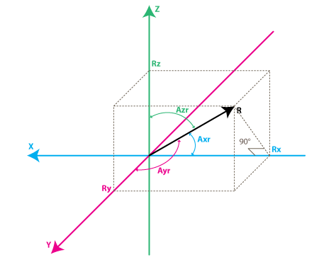
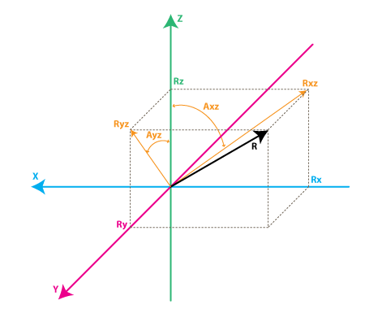

# Attitude Heading Reference System

An *A*ttitude *H*eading *R*eference *S*ystem (AHRS) is a set of devices and algorithms that provides [heading](http://en.wikipedia.org/wiki/Aircraft_heading#Aircraft_heading), [attitude](http://en.wikipedia.org/wiki/Aircraft_attitude) and [yaw information](http://en.wikipedia.org/wiki/Yaw_angle#Tait.E2.80.93Bryan_angles) for aircrafts.

This section provides an overview to AHRS and IMU systems. Other sections will treat how this is implemmented in the code.

In a nutshell, an AHRS provides 3D orientation by integrating gyroscopes, fusing this data with accelerometer data and magnetometer data. With sensor fusion, drift from the gyroscopes integration is compensated for by reference vectors, namely gravity and the earth magnetic field.

-----

*Inertial Measurement Units* (IMU) are electronic devices that measure and report a vehicle's velocity, orientation, and gravitational forces and are used to maneuver aircraft.

The IMU is usually, depending on the manufacturer, either a simple sensor unit without angle transformation, or a sensor unit with angle transformation, but they don't include augmentation.

-----

This section will cover the following topics:
- *what does an accelerometer measure*
- *what does a gyroscope measure*
- *making sense of the sensor's values*: how to convert analog-to-digital (ADC) readings that you get from these sensor to physical units (those would be g for accelerometer, deg/s for gyroscope)
- *implementing a simple AHRS*: how to combine accelerometer and gyroscope readings in order to obtain accurate information about the inclination of your device relative to the ground plane (implementing an AHRS out of the IMU readings)

### Accelerometers

#### Simplified model
When thinking about accelerometers it is often useful to image a box in shape of a cube with a ball inside it.


If we take this box in a place with no gravitation fields or for that matter with no other fields that might affect the ball's position – the ball will simply float in the middle of the box.

From the picture above you can see that we assign to each axis a pair of walls (**we removed the wall `Y+` so we can look inside the box**). Imagine that each wall is pressure sensitive. If we move suddenly the box to the left (we accelerate it with acceleration `1g = 9.8 m/s^2`), the ball will hit the wall `X-`. We then measure the pressure force that the ball applies to the wall and output a value of `-1g` on the `X axis`:


Note that the accelerometer will actually detect a force that is directed in the opposite direction from the acceleration vector. This force is often called **Inertial Force or Fictitious Force**. One thing you should learn from this is that an accelerometer measures acceleration indirectly through a force that is applied to one of it's walls (according to this model, accelerometers might be a spring or something else in real life). This force can be caused by the acceleration , but as we'll see in the next example it is not always caused by acceleration.

If we take our model and put it on Earth the ball will fall on the `Z-` wall and will apply a force of `1g` on the bottom wall, as shown in the picture below:


In this case the box isn't moving but we still get a reading of `-1g` on the `Z axis`. The pressure that the ball has applied on the wall was **caused by a gravitation force**. In theory it could be a different type of force. For example, if you imagine that our ball is metallic, placing a magnet next to the box could move the ball so it hits another wall. This was said just to prove that in essence accelerometer measures force not acceleration. It just happens that acceleration causes an inertial force that is captured by the force detection mechanism of the accelerometer.

While *this model is not exactly how a MEMS sensor is constructed* it is often useful in solving accelerometer related problems. There are actually similar sensors that have metallic balls inside, they are called **tilt switches**, however they are more primitive and usually they can only tell if the device is inclined within some range or not, not the extent of inclination.

So far we have analyzed the accelerometer output on a single axis and this is all you'll get with a single axis accelerometers. The real value of triaxial accelerometers comes from the fact that they can detect inertial forces on all three axes. Let's go back to our box model, and let's rotate the box 45 degrees to the right. The ball will touch 2 walls now: Z- and X- as shown in the picture below:


The values of `0.71` are not arbitrary, they are actually an approximation for $$\sqrt(\frac{1}{2})$$. This will become more clear as we introduce our next model for the accelerometer.

#### An improved model

In the previous model we have fixed the gravitation force and rotated our imaginary box. In last 2 examples we have analyzed the output in 2 different box positions, while the force vector remained constant. While this was useful in understanding how the accelerometer interacts with outside forces, it is more practical to perform calculations if we fix the coordinate system to the axes of the accelerometer and imagine that the force vector rotates around us.


In the model above the colors of the axes are preserved so that the **mental transition** from the previous model to the new one is nicer. Just imagine that each axis in the new model is perpendicular to the respective faces of the box in the previous model. The `vector R` is the force vector that the accelerometer is measuring (it could be either the gravitation force or the inertial force from the examples above or a combination of both). $$R_x$$, $$R_y$$, $$R_z$$ are projection of the R vector on the `X`,`Y` and `Z` axes. Please notice the following relation:

$$R^2 = R_x^2 + R_y^2 + R_z^2$$

which is basically the equivalent of the [Pythagorean theorem in 3D](http://demonstrations.wolfram.com/PythagoreanTheorem3D/).

Remember that a little bit earlier we mentioned that the values of $$\sqrt(\frac{1}{2}) \approx 0.71$$ are not random. If you plug them in the formula above, after recalling that our gravitation force was `1 g` we can verify this matter.

The values $$R_x$$, $$R_y$$, $$R_z$$ are actually linearly related to the values that your real-life accelerometer will output and that you can use for performing various calculations.

Most accelerometers will fall in two categories: digital and analog. Digital accelerometers will give you information using a **serial protocol** like I2C , SPI or UART, while analog accelerometers will **output a voltage level** within a predefined range that you have to convert to a digital value using an ADC (analog to digital converter) module.

#### Making sense of sensor values

Let's move on by considering a simple example, suppose our `10bit ADC` module gave us the following values for the three accelerometer channels (axes):

---

A `10-bit ADC` module will output a value in the range of `0..1023`, note that $$1023 = 2^10 - 1$$.

---

$$AdcR_x = 586$$
$$AdcR_y = 630$$
$$AdcR_z = 561$$

Each ADC module will have a reference voltage, let's assume in our example it is `3.3V`. To convert a 10bit adc value to voltage we use the following formula:

$$ VoltsR_x = \frac{AdcR_x * V_{ref}}{1023}$$

Applying this formula to all 3 channels we get (rounded to 2 decimal points):

$$VoltsR_x = \frac{586 * 3.3V}{1023} \approx 1.89V $$
$$VoltsRy = \frac{630 * 3.3V}{1023} \approx 2.03V$$
$$VoltsRz = \frac{561 * 3.3V }{ 1023} \approx 1.81V$$

Each accelerometer has a **zero-g voltage level**, you can find it in specs (datasheet), this is the voltage that corresponds to `0g`. To get a signed voltage value we need to calculate the shift from this level. Let's say our 0g voltage level is $$Vzero_G = 1.65V$$. We calculate the voltage shifts from zero-g voltage as follows::

$$DeltaVoltsR_x = 1.89V – 1.65V = 0.24V$$
$$DeltaVoltsR_y = 2.03V – 1.65V = 0.38V$$
$$DeltaVoltsR_z = 1.81V – 1.65V = 0.16V$$

We now have our accelerometer readings in Volts, it's still not in `g` ($$9.8 \frac{m}{s^2}$$), to do the final conversion we apply the **accelerometer sensitivity**, usually expressed in `mV/g`. Lets say our $$Sensitivity = 478.5mV/g = 0.4785V/g$$. Sensitivity values can be found in accelerometer specifications. To get the final force values expressed in g we use the following formula $$R_x = \frac{DeltaVoltsR_x}{Sensitivity}$$:


$$Rx = \frac{0.24 V}{0.4785 V/g} \approx 0.5g$$
$$Ry = \frac{0.38V}{0.4785 V/g} \approx 0.79g$$
$$Rz = \frac{0.16V}{0.4785 V/g} \approx 0.33g$$

All the previous steps can be convined in the following formula (exemplified for the `x` case):

$$R_x = \frac{\frac{AdcR_x * Vref}{1023} - VzeroG}{Sensitivity} (g)$$

We now have all 3 components that define our inertial force vector, if the device is not subject to other forces other than gravitation, we can assume this is the direction of our gravitation force vector. If you want to calculate inclination of device relative to the ground you can calculate the angle between this vector and Z axis.

If you are also interested in per-axis direction of inclination you can split this result into 2 components: inclination on the `X` and `Y axis` that can be calculated as the angle between gravitation vector and X / Y axes. Calculating these angles is more simple than you might think, now that we have calculated the values for $$R_x$$, $$R_y$$ and $$R_z$$. Let's go back to our last accelerometer model and do some additional notations:



The angles that we are interested in are the angles between `X`,`Y`,`Z` axes and the `force vector R`. We'll define these angles as $$Axr$$, $$Ayr$$, $$Azr$$. You can notice from the right-angle triangle formed by $$R$$ and $$Rx$$ that:

$$ cos(Axr) = \frac{Rx}{R} $$
$$ cos(Ayr) = \frac{Ry}{R} $$
$$ cos(Azr) = \frac{Rz}{R} $$

---

We can deduct from previous equations that $$R = \sqrt( Rx^2 + Ry^2 + Rz^2)$$.

---

We can find now our angles by using `arccos()` function (the inverse `cos()` function ):

$$Axr = arccos(\frac{Rx}{R})$$
$$Ayr = arccos(\frac{Ry}{R})$$
$$Azr = arccos(\frac{Rz}{R})$$

We've gone a long way to explain the accelerometer model, just to come up to these formulas. Depending on your applications you might want to use any intermediate formulas that we have derived. We'll also introduce the gyroscope model soon, and we'll see how accelerometer and gyroscope data can be combined to provide even more accurate inclination estimations.

But before we do that let's do some more useful notations:

$$cosX = cos(Axr) = \frac{Rx}{R}$$
$$cosY = cos(Ayr) = \frac{Ry}{R}$$
$$cosZ = cos(Azr) = \frac{Rz}{R}$$

This triplet is often called Direction Cosine, and it basically represents the unit vector (vector with length 1) that has same direction as our R vector.

This is a nice property since it absolve us from monitoring the modulus(length) of R vector. Often times if we're just interested in direction of our inertial vector, it makes sense to normalize it's modulus in order to simplify other calculations.

### Gyroscope

We're not going to introduce any equivalent box model for the gyroscope like we did for accelerometer, instead we're going to jump straight to the second accelerometer model and we'll show what does the gyroscope measure according to this model:



Each gyroscope channel measures the rotation around one of the axes. For instance a 2-axes gyroscope will measure the rotation around (or some may say "about") the X and Y axes. To express this rotation in numbers let's do some notations. First let's define:

- $$Rxz$$ – is the projection of the inertial force `vector R` on the `XZ plane`
- $$Ryz$$ – is the projection of the inertial force `vector R` on the `YZ plane`

From the right-angle triangle formed by $$Rxz$$ and $$Rz$$, using Pythagorean theorem we get:

$$Rxz^2 = Rx^2 + Rz^2$$
$$Ryz^2 = Ry^2 + Rz^2$$

We're going to define the angle between the `Z axis` and $$Rxz$$, $$Ryz$$ vectors as follows:

- $$Axz$$ – is the angle between the $$Rxz$$ (projection of R on XZ plane) and `Z axis`
- $$Ayz$$ – is the angle between the $$Ryz$$ (projection of R on YZ plane) and `Z axis`

Now we're getting closer to what the gyroscope measures. Gyroscope measures the rate of changes of the angles defined above. In other words it will output a value that is linearly related to the rate of change of these angles. To explain this **let's assume that we have measured the rotation angle around axis Y** (that would be $$Axz$$ angle) at time `t0`, and we define it as $$Axz0$$, next we measured this angle at a later time `t1` and it was $$Axz1$$. The rate of change will be calculated as follows:

$$ RateAxz = \frac{Axz1 – Axz0}{t1 – t0} $$

If we express $$Axz$$ in degrees, and time in seconds , then this value will be expressed in `deg/s`. *This is what a gyroscope measures*.

In practice a gyroscope (unless it is a special digital gyroscope) will rarely give you a value expressed in `deg/s`. Same as for accelerometer you'll get an ADC value that you'll need to convert to `deg/s` using a formula similar to what we have defined for accelerometer. Let's introduce the ADC to `deg/s` conversion formula for gyroscope (we assume we're using a 10bit ADC module, for 8bit ADC replace 1023 with 255, for 12bit ADC replace 1023 with 4095):
```
RateAxz = (AdcGyroXZ * Vref / 1023 – VzeroRate) / Sensitivity
RateAyz = (AdcGyroYZ * Vref / 1023 – VzeroRate) / Sensitivity
```

We define the values used in the equations:
- $$AdcGyroXZ$$, $$AdcGyroYZ$$ – are obtained from our ADC module and they represent the channels that measure the rotation of projection of `R vector` in `XZ` respectively in `YZ` planes, which is the equivalent to saying rotation was done around Y and X axes respectively.
- $$Vref$$ – is the ADC reference voltage we'll use `3.3V` in the example below
- $$VzeroRate$$ – is the zero-rate voltage, in other words the voltage that the gyroscope outputs when it is not subject to any rotation (you can find this values in the specs – but don't trust the specs most gyros will suffer slight offset after being soldered so measure VzeroRate for each axis output using a voltmeter, usually this value will not change over time once the gyro was soldered, if it variates – write a calibration routine to measure it before device start-up, user must be instructed to keep device in still position  upon start-up for gyros to calibrate).
- $$Sensitivity$$ – is the sensitivity of your gyroscope it is expressed in $$mV/(deg/s)$$ often written as $$mV/deg/s$$ , it basically tells you how many `mV` will the gyroscope output increase , if you increase the rotation speed by one `deg/s`. For example, the sensitivity of [Acc_Gyro](http://www.starlino.com/store/acc-gyro) board is for example 2mV/deg/s or 0.002V/deg/s

Let's take an example, suppose our ADC module returned following values:

$$AdcGyroXZ = 571$$
$$AdcGyroXZ = 323$$

Using the above formula, and using the specs parameters of $$Acc_Gyro$$ board we'll get:
```
RateAxz = (571 * 3.3V / 1023 – 1.23V) / ( 0.002V/deg/s) =~ 306 deg/s
RateAyz = (323 * 3.3V / 1023 – 1.23V) / ( 0.002V/deg/s) =~ -94 deg/s
```
In other words the device rotates around the Y axis (or we can say it rotates in XZ plane) with a speed of `306 deg/s` and around the X axis (or we can say it rotates in YZ plane) with a speed of `-94 deg/s`. Please note that the negative sign means that the device rotates in the opposite direction from the conventional positive direction. By convention one direction of rotation is positive (right-handed axes). ~~A good gyroscope specification sheet will show you which direction is positive~~ (never trust specs), otherwise you'll have to find it by experimenting with the device and noting which direction of rotation results in increasing voltage on the output pin.
This is best done using an oscilloscope since as soon as you stop the rotation the voltage will drop back to the zero-rate level. If you're using a multimeter you'd have to maintain a constant rotation rate for at least few seconds and note the voltage during this rotation, then compare it with the zero-rate voltage. If it is greater than the zero-rate voltage it means that direction of rotation is positive.


### Combining accelerometer and gyroscope data (making an AHRS)

The previous content explained how an IMU delivers its values. We will now see how to convert these values into quantities that we can understand - aka, making an AHRS.

The first step in using a combination IMU device that combines an accelerometer and a gyroscope is to align their coordinate systems. The easiest way to do it is to choose the coordinate system of accelerometer as your reference coordinate system. ~~Most accelerometer data sheets will display the direction of X,Y,Z axes relative to the image of the physical chip or device~~. This probed to be wrong for the `MPU6000` case.

The next steps for a general AHRS implementation should be:
- identify the gyroscope outputs that correspond to RateAxz , RateAyz values discussed above.
- determine if these outputs need to be inverted due to physical position of gyroscope relative to the accelerometer

*Do not assume that if a gyroscope has an output marked X or Y, it will correspond to any axis in the accelerometer coordinate system, even if this output is part of an IMU unit. The best way is to test it.*

We will assume that your axis match, otherwise refer to [this article](http://www.starlino.com/imu_guide.html) for a detail process of how to measure and match your axes. Next we'll analyze the relations between these values that turn out useful in obtaining more accurate estimation of the inclination of the device relative to the ground plane.

You might be asking yourself by this point, if accelerometer model already gave us inclination angles of $$Axr$$,$$Ayr$$,$$Azr$$ why would we want to bother with the gyroscope data ? The answer is simple: accelerometer data can't always be trusted 100%. There are several reason, remember that accelerometer measures inertial force, such a force can be caused by gravitation (and ideally only by gravitation), but it might also be caused by acceleration (movement) of the device. As a result even if accelerometer is in a relatively stable state, **it is still very sensitive to vibration and mechanical noise in general**. This is the main reason why most IMU systems use a gyroscope to smooth out any accelerometer errors. But how is this done ? And is the gyroscope free from noise?

The gyroscope is not free from noise however because it measures rotation it is less sensitive to linear mechanical movements, the type of noise that accelerometer suffers from, however gyroscopes have other types of problems like for example **drift** (not coming back to zero-rate value when rotation stops). Nevertheless by averaging data that comes from accelerometer and gyroscope we can obtain a relatively better estimate of current device inclination than we would obtain by using the accelerometer data alone.

In the next steps we will introduce an *algorithm that was inspired by some ideas used in Kalman filter, however it is by far more simple and easier to implement on embedded devices*. Before that let's see first what we want our algorithm to calculate. Well , it is the direction of gravitation force vector R = [Rx,Ry,Rz] from which we can derive other values like $$Axr$$, $$Ayr$$, $$Azr$$ or $$cosX$$, $$cosY$$, $$cosZ$$ that will give us an idea about the inclination of our device relative to the ground plane, we discuss the relation between these values before. One might say – don't we already have these values Rx, Ry , Rz from previous equations? Well yes, but remember that these values are derived from accelerometer data only, so if you would be to use them directly in your application you might get more noise than your application can tolerate. To avoid further confusion let's re-define the accelerometer measurements as follows:

$$Racc$$ – is the inertial force vector as measured by accelerometer, that consists of following components (projections on X,Y,Z axes):
```
RxAcc = (AdcRx * Vref / 1023 – VzeroG) / Sensitivity
RyAcc = (AdcRy * Vref / 1023 – VzeroG) / Sensitivity
RzAcc = (AdcRz * Vref / 1023 – VzeroG) / Sensitivity
```

So far we have a set of measured values that we can obtain purely from accelerometer ADC values. We'll call this set of data a "vector" and we'll use the following notation.
```
Racc = [RxAcc,RyAcc,RzAcc]
```

Because these components of Racc can be obtained from accelerometer data , we can consider it an input to our algorithm.

---

**Please note that because Racc measures the gravitation force you'll be correct if you assume that the length of this vector defined as follows is equal or close to 1g.**

```
|Racc| = SQRT(RxAcc^2 +RyAcc^2 + RzAcc^2),
```

---


However to be sure it makes sense to update this vector as follows:

```
Racc(normalized) = [RxAcc/|Racc| , RyAcc/|Racc| , RzAcc/|Racc|]
```

This will ensure the length of your normalized $$Racc$$ vector is always 1.
Next we'll introduce a new vector and we'll call it $$Rest$$:
```
Rest = [RxEst,RyEst,RzEst]
```

This will be the output of our algorithm , these are corrected values based on gyroscope data and based on past estimated data.

Here is what our algorithm will do:
- accelerometer tells us: "**You are now at position Racc**"
- we say "Thank you, but let me check",
- then correct this information with gyroscope data as well as with past $$Rest$$ data and we output a new **estimated vector Rest**.
- we consider Rest to be our "best bet" as to the current position of the device.

Let's see how we can make it work. We'll start our sequence by trusting our accelerometer and assigning:
```
Rest(0) = Racc(0)
```
By the way remember $$Rest$$ and $$Racc$$ are vectors, so the above equation is just a simple way to write 3 sets of equations, and avoid repetition:
```
RxEst(0) = RxAcc(0)
RyEst(0) = RyAcc(0)
RzEst(0) = RzAcc(0)
```

Next we'll do regular measurements at **equal time intervals of T seconds**, and we'll obtain new measurements that we'll define as `Racc(1)`, `Racc(2)` , `Racc(3)` and so on. We'll also issue new estimates at each time intervals `Rest(1)`, `Rest(2)`, `Rest(3)` and so on.

Suppose we're at step n. We have two known sets of values that we'd like to use:

- `Rest(n-1)` – our previous estimate, with Rest(0) = Racc(0)
- `Racc(n)` – our current accelerometer measurement

Before we can calculate `Rest(n)` , let's introduce a new measured value, that we can obtain from our gyroscope and a previous estimate.

We'll call it Rgyro , and it is also a vector consisting of 3 components:
```
Rgyro = [RxGyro,RyGyro,RzGyro]
```

We'll calculate this vector one component at a time. We'll start with $$RxGyro$$:


Let's start by observing the following relation in our gyroscope model, from the right-angle triangle formed by $$Rz$$ and $$Rxz$$ we can derive that:
```
tan(Axz) = Rx/Rz => Axz = atan2(Rx,Rz)
```
`Atan2` might be a function you never used before, it is similar to `atan`, except it returns values in range of `(-PI,PI)` as opposed to `(-PI/2,PI/2)` as returned by `atan`, and it takes 2 arguments instead of one. It allows us to convert the two values of $$Rx$$, $$Rz$$ to angles in the full range of 360 degrees (-PI to PI). You can read more about atan2 [here](http://en.wikipedia.org/wiki/Atan2).

So knowing `RxEst(n-1)` , and `RzEst(n-1)` we can find:
```
Axz(n-1) = atan2( RxEst(n-1) , RzEst(n-1) )
```

Remember that gyroscope measures the rate of change of the Axz angle. So we can estimate the new angle Axz(n) as follows:
```
Axz(n) = Axz(n-1) + RateAxz(n) * T
```

Remember that RateAxz can be obtained from our gyroscope ADC readings. A more precise formula can use an average rotation rate calculated as follows:
```
RateAxzAvg = ( RateAxz(n) + RateAxz(n-1) ) / 2
Axz(n) = Axz(n-1) + RateAxzAvg * T
```
The same way we can find:
```
Ayz(n) = Ayz(n-1) + RateAyz(n) * T
```
Ok so now we have Axz(n) and Ayz(n). Where do we go from here to deduct RxGyro/RyGyro ? We can write the length of vector Rgyro as follows:
```
|Rgyro| = SQRT(RxGyro^2 + RyGyro^2 + RzGyro^2)
```

Also because we normalized our Racc vector, we may assume that it's length is 1 and it hasn't changed after the rotation, so it is relatively safe to write:
```
|Rgyro| = 1
```

*Let's adopt a temporary shorter notation for the calculations below:*
```
x =RxGyro , y=RyGyro, z=RzGyro
```
Using the relations above we can write:
```
x = x / 1 = x / SQRT(x^2+y^2+z^2)
```
Let's divide numerator and denominator of fraction by `SQRT(x^2 + z^2)`
```
x = ( x / SQRT(x^2 + z^2) ) / SQRT( (x^2 + y^2 + z^2) / (x^2 + z^2) )
```
Note that `x / SQRT(x^2 + z^2) = sin(Axz)`, so:
```
x = sin(Axz) / SQRT (1 + y^2 / (x^2 + z^2) )
```
Now multiply numerator and denominator of fraction inside `SQRT` by `z^2`:
```
x = sin(Axz) / SQRT (1 + y^2  * z ^2 / (z^2 * (x^2 + z^2)) )
```
Note that `z / SQRT(x^2 + z^2) = cos(Axz)` and `y / z = tan(Ayz)`, so finally:
```
x = sin(Axz) / SQRT (1 + cos(Axz)^2 * tan(Ayz)^2 )
```

Going back to our notation we get:
```
RxGyro = sin(Axz(n)) / SQRT (1 + cos(Axz(n))^2 * tan(Ayz(n))^2 )
```
same way we find that
```
RyGyro = sin(Ayz(n)) / SQRT (1 + cos(Ayz(n))^2 * tan(Axz(n))^2 )
```

---

*Side Note*: it is possible to further simplify this formula. By dividing both parts of the fraction by `sin(Axz(n))` you get:
```
RxGyro =  1  / SQRT (1/ sin(Axz(n))^2  + cos(Axz(n))^2 / sin(Axz(n))^2  * tan(Ayz(n))^2 )
RxGyro =  1  / SQRT (1/ sin(Axz(n))^2  + cot(Axz(n))^2  * sin(Ayz(n))^2  / cos(Ayz(n))^2 )
```
now add and substract     `cos(Axz(n))^2/sin(Axz(n))^2   = cot(Axz(n))^2`
```
RxGyro =  1  / SQRT (1/ sin(Axz(n))^2  -  cos(Axz(n))^2/sin(Axz(n))^2   + cot(Axz(n))^2  * sin(Ayz(n))^2  / cos(Ayz(n))^2  + cot(Axz(n))^2 )
```
and by grouping  terms 1&2 and then 3&4  we get:
```
RxGyro =  1  / SQRT (1  +   cot(Axz(n))^2 * sec(Ayz(n))^2 )
```
where  `cot(x) = 1 / tan(x)`  and  `sec(x) = 1 / cos(x)`
This formula uses only 2 trigonometric functions and can be computationally less expensive. If you have Mathematica program you can verify it
by evaluating

```
FullSimplify [Sin[A]^2/ ( 1 + Cos[A]^2  * Tan[B]^2)]
```
---

Now, finally we can find:
```
RzGyro  =  Sign(RzGyro)*SQRT(1 – RxGyro^2 – RyGyro^2).
```
Where `Sign(RzGyro) = 1` when `RzGyro>=0` , and `Sign(RzGyro) = -1` when `RzGyro<0`.

One simple way to estimate this is to take:
```
Sign(RzGyro) = Sign(RzEst(n-1))
```

In practice be careful when `RzEst(n-1)` is close to `0`. You may skip the gyro phase altogether in this case and assign:  `Rgyro = Rest(n-1)`. `Rz` is used as a reference for calculating $$Axz$$ and $$Ayz$$ angles and when it's close to `0`, values may overflow and trigger bad results. You'll be in domain of large floating point numbers where `tan() / atan()` function implementations may lack precision.


So let's recap what we have so far, we are at step n of our algorithm and we have calculated the following values:

- $$Racc$$ – current readings from our accelerometer
- $$Rgyro$$ – obtained from Rest(n-1) and current gyroscope readings

Which values do we use to calculate the updated estimate `Rest(n)`? You probably guessed that we'll use both. We'll use a weighted average, so that:
```
Rest(n) = (Racc * w1 + Rgyro * w2 ) / (w1 + w2)
```
We can simplify this formula by dividing both numerator and denominator of the fraction by `w1`.
```
Rest(n) = (Racc * w1/w1 + Rgyro * w2/w1 ) / (w1/w1 + w2/w1)
```
and after substituting `w2/w1 = wGyro` we get:
```
Rest(n) = (Racc + Rgyro * wGyro ) / (1 + wGyro)
```

In the above formula `wGyro` tells us how much we trust our gyro compared to our accelerometer. This value can be chosen experimentally usually values between `5..20` will trigger good results.

**The main difference of this algorithm from Kalman filter is that this weight is relatively fixed, whereas in Kalman filter the weights are permanently updated based on the measured noise of the accelerometer readings. Kalman filter is focused at giving you "the best" theoretical results, whereas this algorithm can give you results "good enough" for your practical application. You can implement an algorithm that adjusts `wGyro` depending on some noise factors that you measure, but fixed values will work well for most applications.**

We are one step away from getting our updated estimated values:
```
RxEst(n) = (RxAcc + RxGyro * wGyro ) / (1 + wGyro)
RyEst(n) = (RyAcc + RyGyro * wGyro ) / (1 + wGyro)
RzEst(n) = (RzAcc + RzGyro * wGyro ) / (1 + wGyro)
```
Now let's  normalize this vector again:
```
R = SQRT(RxEst(n) ^2 + RyEst(n)^2 +  RzEst(n)^2 )
```
```
RxEst(n) = RxEst(n)/R
RyEst(n) = RyEst(n)/R
RzEst(n) = RzEst(n)/R
```

And we're ready to repeat our loop as many times as needed ;).


###Sources:
- [Attitude and heading reference system - Wikipedia](http://en.wikipedia.org/wiki/Attitude_and_heading_reference_system)
- [A Guide To using IMU (Accelerometer and Gyroscope Devices) in Embedded Applications](http://www.starlino.com/imu_guide.html)
- [BeaglePilot attitude issue](https://groups.google.com/forum/#!topic/drones-discuss/R2u0j-QCUe8)
