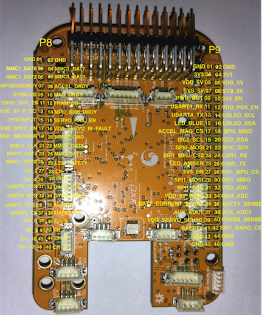

#Hardware Map

Below we present the hardware map pinout of the PXF:

| **Pin** | **Function** |			| **Pin** | **Function** |
|---------|--------------|-----------|---------|--------------|
| P8.1 | GND |				| P9.1 | GND|
| P8.2 |GND	|				| P9.2 | GND|
| P8.3 | MMC1_DAT6 |			| P9.3 | 3V3|
| P8.4 | MMC1_DAT7 |			| P9.4 | 3V3|
| P8.5 | MMC1_DAT2|			| P9.5 | VDD_5V|
| P8.6 | MMC1_DAT3 |				| P9.6 | VDD_5V|
| P8.7 |MPU_6500_DRDY		 |				| P9.7 | SYS_5V|
| P8.8 |ACCEL_DRDY			 |				| P9.8 | SYS_5V|
| P8.9 | GYRO_CS |				| P9.9 | PWR_BUT|
| P8.10 | MAG_DRDY |				| P9.10 | 3v3_EN|
| P8.11 |SBUS_OUTPUT_EN |				| P9.11 | USART4_RX|
| P8.12 | FRAM_CS |				| P9.12 | VDD_5V_PERIPH_EN|
| P8.13 | VDD_5V_PERIPH_OC |				| P9.13 | USART4_TX|
| P8.14 | MPU_6000_DRDY|				| P9.14 | UBLED-SCL|
| P8.15 | PPM_INPUT |				| P9.15 | LED_BLUE|
| P8.16 | SERVO_RAIL_IN_EN|				| P9.16 | UBLED-SDA|
| P8.17 | VDD_3V3_SEPKTRUM_EN |				| P9.17 | ACCEL_MAG_CS|
| P8.18 | VDD_SERVO_IN_FAULT |				| P9.18 | SPI_0_MISO|
| P8.19 | VDD_5V_HIPOWER_OC |				| P9.19 | I2C2_SCL|
| P8.20 | MMC1_CMD |				| P9.20 | I2C2_SDA|
| P8.21 | MMC1_CLK |				| P9.21 | SPI_0_MOSI|
| P8.22 | MMC1_DAT5|				| P9.22 | SPI_0_SCK|
| P8.23 | MMC1_DAT4|				| P9.23 | SPI_1_MPU_CS2|
| P8.24 | MMMC1_DAT1 |				| P9.24 | CAN1_RX_1|
| P8.25 | MMC1_DAT0 |				| P9.25 | LED_AMBER|
| P8.26 | LED_SAFETY |				| P9.26 | CAN1_TX_1|
| P8.27 | CH_2 |					| P9.27 | 3V3_EN|
| P8.28 | CH_1 |					| P9.28 | SPI_1_MPU_CS|
| P8.29 | CH_4 |					| P9.29 | SPI_1_MOSI|
| P8.30 | CH_3 |					| P9.30 | SPI_1_MISO|
| P8.31 | USART5_CTS |				| P9.31 | SPI_1_SCK|
| P8.32 | USART5_RTS |				| P9.32 | VDD_ADC|
| P8.33 | USART4_RTS |				| P9.33 | VDD_5V_SENS|
| P8.34 | GYRO_DRDY |				| P9.34 | GND_ADC|
| P8.35 | USART4_CTS |				| P9.35 | BATT_CURRENT_SENS|
| P8.36 | ALARM |				| P9.36 | BATT_VOLTAGE_SENS|
| P8.37 | USART5_TX|				| P9.37 | AUX_ADC1|
| P8.38 | USART5_RX|				| P9.38 | AUX_ADC2|
| P8.39 | CH_6 |				| P9.39 | VDD_SERVO_SENS|
| P8.40 | CH_5 |				| P9.40 | PRESSURE_SENS|
| P8.41 | CH_8 |				| P9.41 | SAFETY|
| P8.42 | CH_7 |				| P9.42 | SPI_1_BARO_CS|
| P8.43 | CH_10 |				| P9.43 | GND|
| P8.44 | CH_9 |				| P9.44 | GND|
| P8.45 | CH_12 |				| P9.45 | GND|
| P8.46 | CH_11 |				| P9.46 | GND|
