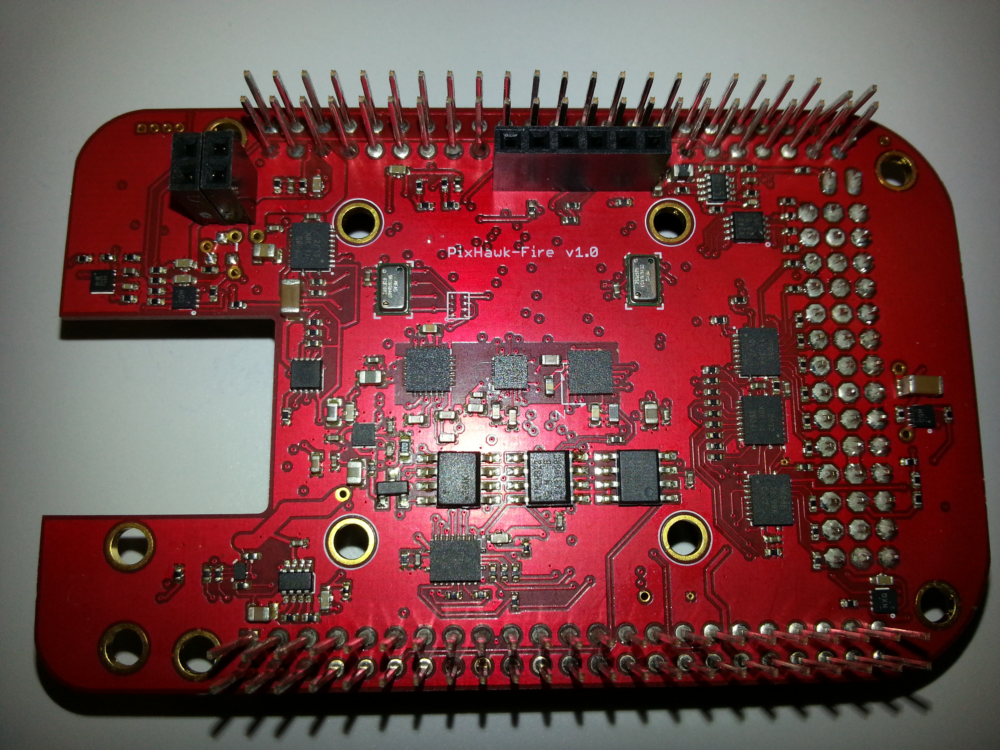
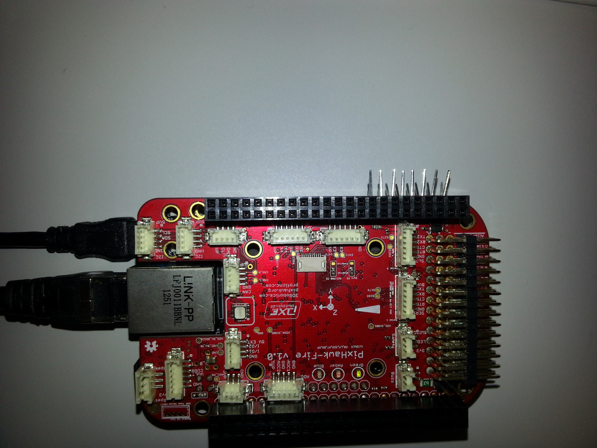

# BBB-PXF

The [PixHawk Fire Cape](https://github.com/diydrones/PXF) (PXF) is a cape for the BeagleBone Black developed by Philip Rowse. The board is used to support the `AP_HAL_Linux` of ardupilot.

### Setup instructions for PXF v1.0
#### Prepare the PXF

Revision `1.0` has a booting issue that make the BB or the BBB not to boot. A quick fix for this matter is to bend pins *P8* `46` to `31` so that they don't enter.

#### Prepare the BBB

----

*Don't plug yet the PXF into the BBB.*

----

Fetch the [microSD card image]() that we provide and verify that it works in the BB (or BBB). We actually recommend to fetch a BB for developing purposes (because it has availability of a serial port on the miniUSB which allows to launch a serial console through `minicom` or `screen`).

The BB (or BBB) should boot properly. At this point we are ready to put the cape over the BBB (or BBB).

#### PXF+BBB

Insert the cape nicely into the BBB. And verify that it boots properly.

----

**You might need to try it serveral times. Take in account that this technology is still unmature. If something goes wrong, you could additionally fetch a BB and check the booting process.**

----

Once the board has booted (and you've logged in, which usually is done using `ssh root@192.168.7.2`) you should verify that all the sensors are working properly.

