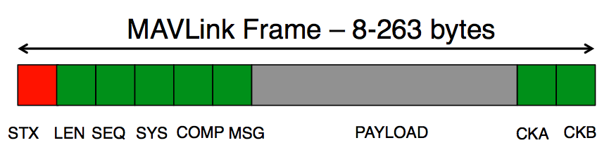

# MAVLink

 MavLink is a communication protocol for MAV (Micro Aerial Vehicles) that has nowadays been extended to all kind of drones (both aerial and terrestrial).

### MAVLink package

The MAVLink package is basically a stream of bytes encoded and sent over some kind of transductor (via USB serial, RC frequencies, WiFi, GPRS, etc.). By encoding we mean  to put the packet into a data structure in a *smart way* adding **checksums**, **sequence numbers** and send it via the channel byte by byte.

#### Structure of the package

Each MAVLink package is structured in the following way:

The following table describes the message parts and bytes:

| **Message part** | **Byte** | **Description** | **Value** |
|------------------|----------|-----------------|-----------|
| Header | 0 | Indicates the start of a new packet | v1.0: `0xFE` (v0.9: `0x55`) |
| Header | 1 | Indicates length of the following payload | 0 - 255 |
| Header | 2 | Sequence number, rolls from 0 to 255. Each component counts up his send sequence. Allows to detect packet loss | 0 - 255 |
| Header | 3 | ID of the SENDING system. Allows to differentiate different MAVs on the same network. | 1 - 255 |
| Header | 4 | ID of the SENDING component. Allows to differentiate different components of the same system, e.g. the IMU and the autopilot | 0 - 255 |
| Header | 5 | ID of the message (e.g. 0 = heartbeat) - the id defines what the payload "means" and how it should be correctly decoded. | 0 - 255 |
| *Payload* | 6 - (n + 6) | Variable sized payload specified by the byte | (0 - 255) bytes |
| **Checksum** | (n+7) to (n+8) | ITU X.25/SAE AS-4 hash, excluding packet start sign, so bytes 1..(n+6) Note: The checksum also includes MAVLINK_CRC_EXTRA (Number computed from message fields. Protects the packet from decoding a different version of the same packet but with different variables) | |

Some comments:
- The checksum is the same as used in ITU X.25 and SAE AS-4 standards (CRC-16-CCITT), documented in SAE AS5669A. Please see the MAVLink source code for a documented C-implementation of it.
- The minimum packet length is 8 bytes for acknowledgement packets without payload
- The maximum packet length is 263 bytes for full payload

### Supported data types
MAVLink supports fixed-size integer data types, IEEE 754 single precision floating point numbers, arrays of these data types (e.g. char[10]) and the special `mavlink_version` field, which is added automatically by the protocol. These types are available:

- `char` - Characters / strings
- `uint8_t` - Unsigned 8 bit
- `int8_t` - Signed 8 bit
- `uint16_t` - Unsigned 16 bit
- `int16_t` - Signed 16 bit
- `uint32_t` - Unsigned 32 bit
- `int32_t` - Signed 32 bit
- `uint64_t` - Unsigned 64 bit
- `int64_t` - Signed 64 bit
- `float` - IEEE 754 single precision floating point number
- `double` - IEEE 754 double precision floating point number
- `uint8_t_mavlink_version` - Unsigned 8 bit field automatically filled on sending with the current MAVLink version - it cannot be written, just read from the packet like a normal `uint8_t` field

### Performance
This protocol was totally geared towards two properties: Transmission speed and safety. It allows to check the message content, it also allows to detect lost messages but still only needs six bytes overhead for each packet. Some transmission examples are presented below:

| **Link speed** |	**Hardware** |	 **Update rate**|	 **Payload**| **Float values**|
|----------------|---------------|------------------|---------------|-----------------|
|115200 baud    |   XBee Pro 2.4 GHz|	 50 Hz|	 224 bytes|	 56|
|115200 baud	| XBee Pro 2.4 GHz|	 100 Hz|	 109 bytes|	 27|
|57600 baud|	 XBee Pro 2.4 GHz|	 100 Hz|	 51 bytes|	 12|
|9600 baud|	 XBee Pro XSC 900|	 50 Hz|	 13 bytes|	 3|
|9600 baud|	 XBee Pro XSC 900|	 20 Hz|	 42 bytes|	 10|

### Sources:
- [MavLink Tutorial for Absolute Dummies (Part –I)](http://api.ning.com/files/i*tFWQTF2R*7Mmw7hksAU-u9IABKNDO9apguOiSOCfvi2znk1tXhur0Bt00jTOldFvob-Sczg3*lDcgChG26QaHZpzEcISM5/MAVLINK_FOR_DUMMIESPart1_v.1.1.pdf)
- http://qgroundcontrol.org/mavlink/start
