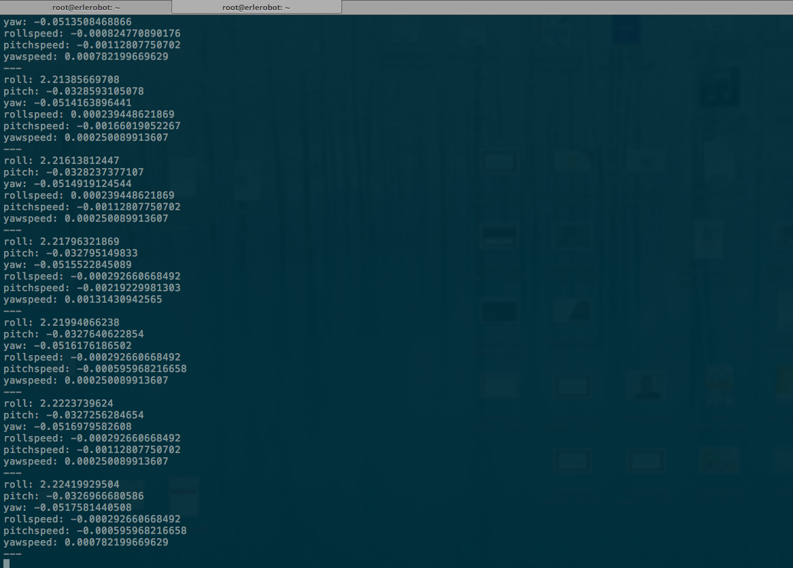
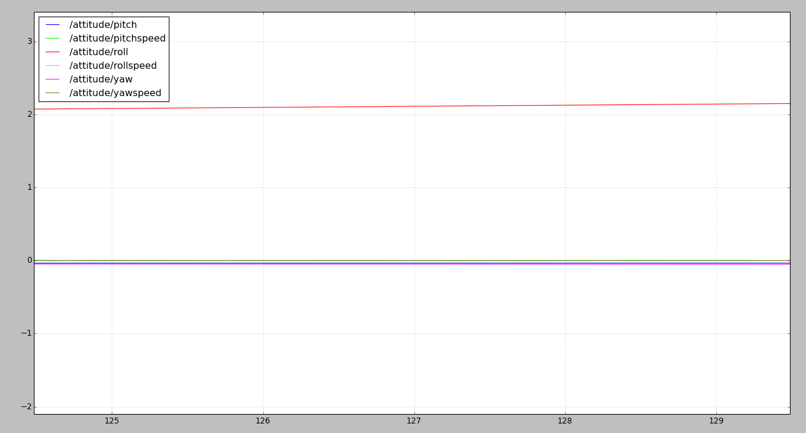
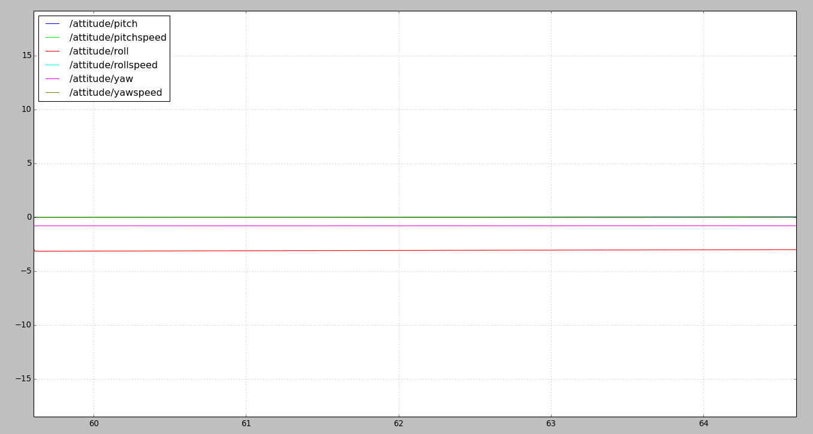
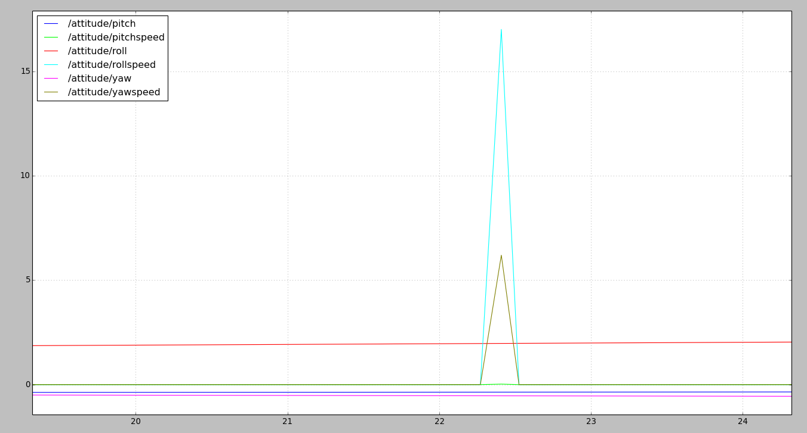

# roscopter

[roscopter](https://github.com/cberzan/roscopter) is a ROS package that implements ROS interface for Arducopter using Mavlink 1.0 interface. It supports controlling the arducopter by overriding the RC command, and it publishes all the sensor data (old package available [here](https://code.google.com/p/roscopter/)).

#### Compiling `autopilot_bridge`

Compilation is performed as described in the [mavlink_ros:compiling instructions](mavlink_ros.md). The package should be downloaded into `~/catkin_ws/src` and `catkin_make` should be called from `catkin_ws` (refer to [ROS: Building a ROS Package](../../ros/tutorials/building_a_ros_package.md) for learning more about ROS package compilation).

Exact instructions for this package are provided with its [source code](https://github.com/cberzan/roscopter).


### Running `roscopter`

```bash
rosrun roscopter roscopter_node.py  --device=/dev/ttyO4 --baudrate=115200
```

```bash
root@erlerobot:~# rosrun roscopter roscopter_node.py  --device=/dev/ttyO5 --baudrate=115200
Waiting for APM heartbeat
Heartbeat from APM (system 1 component 1)
Sending all stream request for rate 10


```

`roscopter` can also be launched using a socket over the network:
```
rosrun roscopter roscopter_node.py  --device tcp:127.0.0.1:6000  --baudrate=115200
```

#### Playing with `roscopter`

In another terminal:
```bash
root@erlerobot:~# rostopic echo /attitude
roll: -0.99837321043
pitch: 0.778631448746
yaw: -0.439931690693
rollspeed: -0.00139412656426
pitchspeed: -0.00105890631676
yawspeed: 0.00113339431118
---
roll: -0.992067933083
pitch: 0.776587665081
yaw: -0.435508549213
rollspeed: -0.000329907052219
pitchspeed: -0.00105890631676
yawspeed: 6.91747991368e-05
---
roll: -0.985788047314
pitch: 0.774523973465
yaw: -0.431112319231
rollspeed: -0.00139412656426
pitchspeed: -0.00105890631676
yawspeed: 6.91747991368e-05
---
roll: -0.979533672333
pitch: 0.772440910339
yaw: -0.426743358374
rollspeed: -0.000329907052219
pitchspeed: -0.00212312862277
yawspeed: 6.91747991368e-05
---
roll: -0.973304569721
pitch: 0.770338177681
yaw: -0.42240139842
rollspeed: -0.000329907052219
pitchspeed: -0.00105890631676
yawspeed: 6.91747991368e-05


```

#### Visualizing `roscopter`


Let's start visualizing the topic `/attitude` values and its graphical representation:

---

**Through all this process the board has been static on our desk. The bad results are not due to the bad performance of the ROS package but to problems with the attitude estimation inside of ArduPilot.**

---

`rostopic echo /attitude`

and a plot using `rqt_plot /attitude/roll:pitch:yaw:rollspeed:pitchspeed:yawspeed`


These values are a bit unexpected so we repeat the process taking several screenshots:
`rostopic echo /attitude`

`rqt_plot /attitude/roll:pitch:yaw:rollspeed:pitchspeed:yawspeed`

`rqt_plot /attitude/roll:pitch:yaw:rollspeed:pitchspeed:yawspeed`

`rqt_plot /attitude/roll:pitch:yaw:rollspeed:pitchspeed:yawspeed`


Seems we have an issue with the attitude :(.

*On the other hand topic `/raw_imu` values cannot be visualized*


