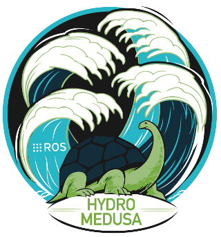

The Robot Operative System (ROS): Powering the world's robots
=========

What is ROS?
-----
The [Robot Operative System](http://www.ros.org/) (ROS) is an **open-source, meta-operating system** for your robot mantained by the [Open Source Robotics Foundation](http://www.osrfoundation.org/) (OSRF). It provides the services you would expect from an operating system, including hardware abstraction, low-level device control, implementation of commonly-used functionality, message-passing between processes, and package management. It also provides tools and libraries for obtaining, building, writing, and running code across multiple computers. ROS is similar in some respects to 'robot frameworks,' such as Player, YARP, Orocos, CARMEN, Orca, MOOS, and Microsoft Robotics Studio.

The ROS runtime "graph" is a *peer-to-peer network of processes* that are loosely coupled using the ROS communication infrastructure. ROS implements several different styles of communication, including synchronous RPC-style communication over services, asynchronous streaming of data over topics, and storage of data on a *Parameter Server*.

**ROS is not a realtime framework**, though it is possible to integrate ROS with realtime code. ROS also has seamless integration with the Orocos Real-time Toolkit.

Goals
-----
The primary goal of ROS is to **support code reuse in robotics research and development**. ROS is a distributed framework of processes (aka Nodes) that enables executables to be individually designed and loosely coupled at runtime. These processes can be grouped into Packages and Stacks, which can be easily shared and distributed. ROS also supports a federated system of code Repositories that enable collaboration to be distributed as well. This design, from the filesystem level to the community level, enables independent decisions about development and implementation, but all can be brought together with ROS infrastructure tools.

In support of this primary goal of sharing and collaboration, there are several other goals of the ROS framework:

- **Thin**: ROS is designed to be as thin as possible -- we won't wrap your main() -- so that code written for ROS can be used with other robot software frameworks. A corollary to this is that ROS is easy to integrate with other robot software frameworks: ROS has already been integrated with OpenRAVE, Orocos, and Player.
- **ROS-agnostic** libraries: the preferred development model is to write ROS-agnostic libraries with clean functional interfaces.
- **Language independence**: the ROS framework is easy to implement in any modern programming language. We have already implemented it in *Python*, *C++*, and *Lisp*, and we have *experimental libraries in Java and Lua*.
- **Easy testing**: ROS has a builtin unit/integration test framework called rostest that makes it easy to bring up and tear down test fixtures.
- **Scaling**: ROS is appropriate for large runtime systems and for large development processes.

Operative Systems
-------
ROS currently only runs on **Unix-based platforms**. Software for ROS is primarily tested on *Ubuntu* and *Mac OS X* systems.

Distributions
----------
The following distributions have been tested in the robot [Erle](http://erlerobot.com).

----

**By default the images provided for Erle come with ROS pre-installed and fully functional.**

----

| Distro | Release date | Poster | Instuctions |
|--------|--------------|--------|-------------|
| [ROS Hydro Medusa](http://wiki.ros.org/hydro) | September 4th, 2013 |  | [Installation](http://wiki.ros.org/hydro/Installation/UbuntuARM) |
| [ROS Groovy Galapagos](http://wiki.ros.org/groovy) | December 31, 2012 |  | [Installation](http://wiki.ros.org/groovy/Installation/UbuntuARM) |

License
-------
Some of this material has been taken from the [ROS wiki](http://wiki.ros.org/). Except where otherwise noted, the ROS wiki is licensed under Creative Commons Attribution 3.0.
