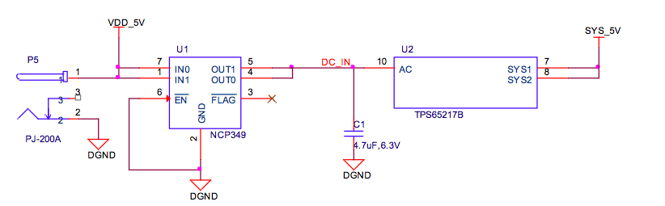

Alimentación
============

La selección de cualquiera de los 5 VDC o el USB como fuente de alimentaci�n se maneja internamente en el TPS65217B y cambia automáticamente a la energ�a 5VDC aunque ambas est�n conectadas. SW puede cambiar la configuraci�n de la corriente a trav�s de la interfaz I2C del procesador. Adem�s, el SO puede leer el TPS65217B y determinar si la placa se est� ejecutando en la entrada de 5 VDC o la entrada USB. Esto puede ser interesante para conocer la capacidad de la Junta para suministrar corriente para cosas como la frecuencia de funcionamiento y las tarjetas de expansi�n.

Administraci�n de energ�a del circuito integrado (PMIC)
--------

La administraci�n de energ�a del circuito integrado ( PMIC ) en el sistema la gestiona [ TPS65217B ] ( http://www.ti.com/product/tps65217b ) . El * TPS65217B * es un chip que consiste en un circuito de alimentaci�n de doble entrada lineal , tres convertidores reductores , cuatro LDO y un impulso convertidor de alta eficiencia para soportar dos cadenas de hasta 10 LEDs en serie . El sistema se suministra por un puerto USB o adaptador de DC . Tres convertidores de alta eficiencia de 2.25MHz est�n dirigidos a proporcionar el voltaje del n�cleo , MPU, y el voltaje de la memoria para la tarjeta .

Los convertidores reductores entran en un modo de baja potencia con cargas ligeras para una m�xima eficiencia en la gama m�s amplia posible de las corrientes de carga . Para aplicaciones de bajo nivel de ruido de los dispositivos pueden ser forzados a PWM de frecuencia fija utilizando la interfaz I2C . Los convertidores reductores permiten el uso de peque�os inductores y condensadores para lograr un peque�o tama�o de soluci�n .

LDO1 y LDO2 tienen como objetivo apoyar el modo de espera del sistema . En el estado SLEEP la corriente de salida se limita a 100uA para reducir la corriente de reposo , mientras que en el funcionamiento normal pueden apoyar * hasta 100 mA cada archivo *. LDO3 y LDO4 pueden soportar hasta * 285 mA cada uno * .
Por defecto ** s�lo LDO1 est� siempre encendido ** pero cualquier carril puede ser configurado para permanecer en estado de suspensi�n . Especialmente los convertidores DCDC pueden permanecer en un modo de PFM de baja potencia para soportar procesador en modo de suspensi�n . El TPS65217B ofrece secuencias flexibles de encendido y apagado y varias funciones de mantenimiento de la casa , tales como salida de una buena potencia , monitor de bot�n , la funci�n de reinicio del hardware y el sensor de temperatura para proteger la bater�a .

La selecci�n de cualquiera de los 5VDC o el USB como fuente de alimentaci�n se maneja internamente en el TPS65217B y cambia autom�ticamente a la energ�a 5VDC aunque ambos est�n conectadas . El software puede cambiar la configuraci�n de la corriente a trav�s de la interfaz I2C del procesador. Adem�s, el software puede leer ** el TPS65217B y determinar si la placa se est� ejecutando en la entrada de 5VDC o la entrada USB . ** Esto puede ser beneficioso para conocer la capacidad de la Junta para suministrar corriente para cosas como la frecuencia de funcionamiento y las tarjetas de expansi�n .

5V DC Potencia de entrada
---------

Una alimentaci�n de 5V DC se puede utilizar para proporcionar alimentaci�n a la placa. La corriente de la fuente de alimentaci�n depende de la cantidad y el tipo de complemento en los tablones est�n conectados a la tarjeta. Para un uso normal, un suministro de 5 VCC nominal de 1A deber�a ser suficiente. Si se espera que un mayor uso de las cabeceras de expansi�n o puerto host USB, entonces se requiere un suministro de corriente m�s alta. Un NCP349 sobre el dispositivo de tensi�n se utiliza para prevenir el taponamiento en de 7 a 12 V fuentes de alimentaci�n por error. El NCP349 se apagar� y el tablero no se enciende. Sin indicador visible se proporciona para indicar que existe una condici�n de sobretensi�n. La junta no se enciende.

------

** La Entrada de energ�a 5V DC no se rellena. Si es necesario, soldar un conector cil�ndrico exterior x 5.5mm positivo 2.1MM centro **
------

Corriente USB
--------

La tarjeta tambi�n puede ser alimentada desde el puerto USB. Un puerto USB t�pico ** est� limitada a un m�ximo de 500 mA. ** Si va a manejar desde el puerto USB, el carril `VDD_5V` no es proporcionada a la cabecera de expansi�n. As� Capes que requieren que el ferrocarril no tendr�n ese riel disponible para su uso.

El suministro de 5 VCC desde el puerto USB se proporciona en el riel `SYS_5V` de la cabecera de expansi�n para su uso por un Cabo.

Consumo de energ�a
--------

| MODE | USB (mA) | DC (mA)* | DC + USB (mA) |
| -----|-----|----|----------|
|Reset| 200 | *80* | 220 |
| UBoot | 370 | *250* | 330 |
| Kernel booting (peak) | 510 | *360* | 470 |
| Kernel Idling | 300 | *180* | 300 |

---

\* En esta columna se muestra el consumo aproximado de la junta cuando un pin de los CES (5V BEC).

---

Cuando el USB est� conectado, el FT2232 y HUB est�n encendidos que provoca un aumento en la corriente. Si no est� conectado el USB, estos dispositivos se encuentran en estado de bajo consumo, por lo tanto esto ahorra aproximadamente 120 mA de corriente y es la raz�n para el aumento de la corriente cuando se conecta el USB.

La corriente fluct�e como ocurren diversos activa, como los LED y los accesos de la tarjeta SD.
