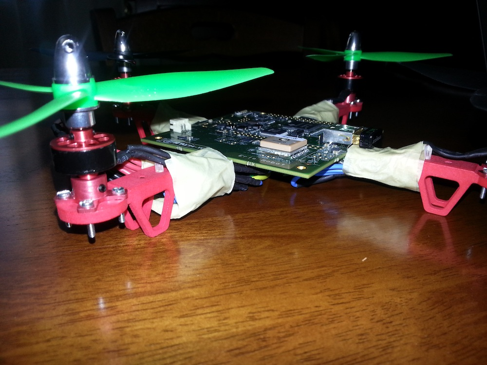

Erle Robotics GitBook
=======================


Book
-----
En este libro aprenderás a como utilizar el drone [Erle](http://erlerobot.com), el **primer robot volador de bajo coste y pequeñas dimensiones**.


About
-----
Durante años hemos estado trabajando en el área de la robótica, particularmente con *drones*. Hemos desarrollado nuestras carreras en Universidades y centros de investigación pero en todos estos lugares hemos encontrado el mismo problema: los drones son **cajas negras** (revisad nuestro [60s pitch](https://www.youtube.com/watch?v=tKAqjyXaC18)). No diseñados para el aprendizaje, la investigación o el desarrollo de aplicaciones. El software es en la mayoría de los casos desconocido o *cerrado* así que: ¿cómo vamos a educar a las siguientes generaciones en esta prometedora tecnología?, ¿cómo comenzamos a prorgramar drones si no disponemos de más de 1000$?, ¿con qué drone trabajamos si no queremos arriesgarnos a perder una mano?.

Llevamos trabajando duro para dar una respuesta a todas estas preguntas: **Erle**.

```
Inspirado por el BeagleBone (un ordenador del tamaño de una tarjeta de crédito), hemos diseñado un robot de pequeñas dimensiones que incluye cerca de 40 sensores, varias interfaces de I/O y capacidad para procesar información en tiempo real.
Erle representa la siguiente generación de robots voladores que se encargarán de resolver tareas en el ámbito urbano. Tareas como la monitorización del medio ambiente, la asistencia aérea en situaciones de riesgo o la vigilancia de zonas que lo requieran.
```

Todo esto en un *pequeño ordenador Linux que vuela*. Con Erle, queremos acercar la robótica a personas y negocios.



Autores
-----
- [Víctor Mayoral Vilches](https://github.com/vmayoral)

    