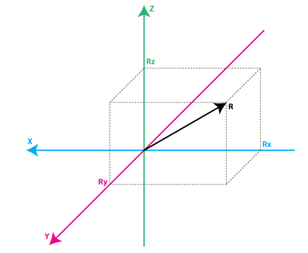

# Attitude Heading Reference System

Un *A*ttitude *H*eading *R*eference *S*ystem (AHRS) es un conjunto de dispositivos y algoritmos que proporcionan [cabeceo (heading)](http://en.wikipedia.org/wiki/Aircraft_heading#Aircraft_heading), [alabeo (attitude)](http://en.wikipedia.org/wiki/Aircraft_attitude) y [guiñada (yaw)](http://en.wikipedia.org/wiki/Yaw_angle#Tait.E2.80.93Bryan_angles) para los aviones.

Esta sección proporciona una visión general de los sitemas AHRS y IMU. Otras secciones trataran como se implementa el código

En pocos palabras, un AHRS proporciona orientación 3D mediante la integración de los giroscopios, la fusión de estos datos con los datos del acelerómetro y dalos del magnetómetro. Con la fusión de sensores, la deriva de la integración de los giroscopos se compensa por los vectores de referencia, denominados la gravedad y el campo mangenético de la tierra.

-----

*Inertial Measurement Units* (IMU)  son dispositivos electrónicos que miden y reportan la velocidad de un vehículo, la orientación y la fuerza de la gravedad y se utilizan para maniobrar la autonave.

La IMU es generalmente, dependiendo del fabricante, o bien una unidad de sensor simple, sin tranformación de ángulo, o una unidad de sensor con la transformación angular, pero no incluyen el aumento.

-----

Esta sección cubre los siguientes aspectos:
- *Que es una medida de un acelerómetro*
- *Que es una medida de un giroscopo*
- *Darle sentido a los valores del sensor*: como convertir las lecturas analógica-digital (ADC) que se obtiene de estos sensores a unidades físicas (lo que serían g de acelerómetro o grados para el girospoco)
- *Implementar un sencillo AHRS*:
- *implementing a simple AHRS*: como combinar las lecturas del acelerómetro y el giróscopo para obtener información precisa acerca de la inclinación de su dispositivo respecto al plano de la tierra

### Acelerómetros

#### Modelo simplificado 
Cuando pesamos sobre los acelerómetros a menuda es útil imaginar un cubo con un bola dentro.


Si tomamos esta caa en un lugar sin campo gravitacional y sin otros campos que puedan afectar a la posición de la pelota - la pelota simplemente flota en el medio de la caja.

A partir de la imagen superior se puede ver que asignamos a cada eje un par de paredes. (** Eliminamos la pared ` Y+ ` para poder ver dentro de la caja**). Imagine que cada pared es sensible a la presión. Si nos movemos repentinamente la casilla de la izquierda (aceleramos con 1g = `9.8m/S^2`), la pelota golpea la pared ` X-`. Se mide la presión que ejerce la pelota contra la pared y la salida es un valor de `-1g en el eje X`:


Tenga en cuenta que el acelerómetro realmente detecta una fuerza que esta dirigida en la dirección opusta a partir del vector de aceleración. Esta fuerza se llama amenudo **Fuerza inercial o fuerza ficticia*. Una cosa que debemos aprender de esto es qe una aceleración medida con un acelerómetro mide idirectamente a través de la fuerda que se aplica a una de sus paredes (de acuerdo con este modelo, los acelerómetros podrían ser un resorte o cualquier otra cosa en la vida real). Esta fuera puede ser causada por la aceleraciń pero como veremos en el siguinete ejemplo, no siempre es causada por la aceleración.

Si tomamos nuestro modelo y lo ponemos en la Tierra caerá la bola en la pared `Z-` y se aplicará ua fuerza de `1g` en la pared inferrior, como se muestra en la siguiente figura:


En este caso la caja no se mueve pero aún así se obtiene una lectura de `-1g` en el `eje Z`.La prsión que la pelota aplica en la pared es causada por ** la fuerza de la gravedad**. En teoría podría ser un tipo diferente de fuerza. Por ejemplo, si imagina que la pelota es metálica, la colocación de un imán a un lado del cuadro se podría mover la pelota para que golpeara cualquier pared. Lo que ocurre es que la aceleración provoca una fuerza inercial que es capturada por el mecanismo de detección fuerzas de aceleración.

Mientras *este modelo no es exactamente cómo se construye un sensor MEMS* a menudo es útil para resolver los problemas relacionados con el acelerómetro. En realidad, hay sensores similadres con bolas metélicas en el interior, se denominan ** till switches **, sin embargo, son más primitivos y por lo general sólo se puede saber si el disposito está inclinado dentro de algún rango o no, no el grado de inclinación.

Hasta ahora se ha analizado la salida del acelerómetro en un solo eje y esto es todo lo que se obtiene con un solo eje del acelerómetro. El valor real de los acelerómetros de 3 ejes proviene del hecho de que pueden detectar fuerzas de inercia en los tres ejes. Volvamos a nuestro modelo de caja, y vamos a girar el cubo 45 grados a la derecha. La pelota tocará 2 paredes ahora: `Z` y `X` como se muestra en la siguiente imagen:


Los valores ` 0.71` no es arbitrario. En realidad es un aproximación a $$\sqrt(\frac{1}{2})$$. Esteo se hará evidente a medida que introduzcamos nuestro próximo modelo para el acelerómero.

#### Un modelo mejorado

En el modelo definido anteriormente se ha fjado la fuerza de la gravedad y girado el cubo imaginario. En los últimos 2 ejemplos qe se han analizado la salida en dos posiciones diferentes del cubo. mientras que el vector de fuerza se mantuvo constante. Eso era útil para comprender como el acelerómetro interactúa con las fuerzas externas, es más práctico para realizar cálculos si fijamos el sistema de coordenadas de los ejes del acelerómetro e imaginamos que el vector de fuerza gira a nuestro alrededor. 



Ahora imagine que cada eje e el nuevo modelo es perpendicular a las caras respectivas del cubo en el modelo anterior. El vector `R` es el vector de fuerza que el acelerómetro está midiedo (podría ser o bien la fuerza de la gravedad o la fuerza de inercia de los ejemplos anteriores o una combinación de ambos). $$R_x$$, $$R_y$$, $$R_z$$ son proyección del vector R en los ejes `X`,`Y` y `Z`. Tenga en cuenta la siguiente relación:

$$R^2 = R_x^2 + R_y^2 + R_z^2$$

que es basicametne una equivalencia del [Teorema de Pitágoras en 3D](http://demonstrations.wolfram.com/PythagoreanTheorem3D/).

Recuerda que un poco antes se ha mencionado que los valores de $$\sqrt(\frac{1}{2}) \approx 0.71$$ no es aleatorio. Si los conecta con la fórmula anterior, después de recordar que la fuerza de gravedad es `1g`, se peude verficar que es correcto.

Los valores $$R_x$$, $$R_y$$, $$R_z$$ están relacionados linealmente con los valores que el acelerómetro devolverá en la vida real y que se pueden utilizar para llevar a cabo ciertos calculos.

La mayoria de los acelerómetros se clasifican en dos categorias: digitales y analógicos: Los acelerómetros digitales transmiten la información a través de un *protocolo serie* como I2C, SPI o UART, mientras que los acelerómetros analógicos retornan un **nivel de voltaje a la salida** dentro de un rango predefinido que se pueden convertir en digital utilizando un conversor analógico digital.

#### Dando sentido a los valores de los sensores

Vamos a pasar a considerar un ejemplo sencillo, supongamos que nuestro conversor analogíco digital tiene `10 bits` para los 3 valores de los acelerómetros

---

Un módulo `10-bit ADC` dará una salida en el rango `0..1023`, teniendo en cuenta $$1023 = 2^10 - 1$$.

---

$$AdcR_x = 586$$
$$AdcR_y = 630$$
$$AdcR_z = 561$$

Cada módulo ADC tendrá un volor de referencia, vamosa suponer que en nuestro caso son `3.3V`. Para convertir un valor de ADC de 10bit la tensión utiliza la siguiente fórmula:

$$ VoltsR_x = \frac{AdcR_x * V_{ref}}{1023}$$

Aplicando la fórmula para los 3 canales se obtiene redondeando con 2 decimales):

$$VoltsR_x = \frac{586 * 3.3V}{1023} \approx 1.89V $$
$$VoltsRy = \frac{630 * 3.3V}{1023} \approx 2.03V$$
$$VoltsRz = \frac{561 * 3.3V }{ 1023} \approx 1.81V$$

Cada acelerómetro tiene un **voltaje de salida para 0g**, lo puedes encontrar en los especificaciones (datasheet). Para obtener un valor de tensión concreto necesitamos calculo. Digamos que nuestro valor de `0g` es de $$Vzero_G = 1.65V$$. Calculamos los cambios de voltaje:

$$DeltaVoltsR_x = 1.89V – 1.65V = 0.24V$$
$$DeltaVoltsR_y = 2.03V – 1.65V = 0.38V$$
$$DeltaVoltsR_z = 1.81V – 1.65V = 0.16V$$

Ahora tenemos las lecturas del acelerómetro en Voltios, pero todavia no están en `g`($$9.8 \frac{m}{s^2}$$), para hacer la conversión ginal aplicamos la **sensibilidad del acelerómetro** generalmente expresada en `mV/g`. Pongamos, $$Sensitivity = 478.5mV/g = 0.4785V/g$$. Este valor se encuentra en la hoja de características del acelerómetro. Para obtener los valores de fuerza finales expresados en `g` utilizamos la siguiente fórmula $$R_x = \frac{DeltaVoltsR_x}{Sensitivity}$$:

$$Rx = \frac{0.24 V}{0.4785 V/g} \approx 0.5g$$
$$Ry = \frac{0.38V}{0.4785 V/g} \approx 0.79g$$
$$Rz = \frac{0.16V}{0.4785 V/g} \approx 0.33g$$

Todos los pasos anterior se pueden combinar como se muestra en la siguiente fórmula ( ejemplificado para `x`):

$$R_x = \frac{\frac{AdcR_x * Vref}{1023} - VzeroG}{Sensitivity} (g)$$

Ahora tenemos las 3 componentes que definen nuestro vector fuerza de inercia, si el dispositivos no esta sujeto a otras fuerzas distintas a la gravedad, se puede asumir que este es el sentido del vector de la fuerza de la gravedad. Si desea calcular la inclinación del dispositivo con respecto al suelo se puede calcular el ángulo entre este vector y el eje `Z` 

Si también está interesado en la dirección por eje de inclinación se puede dividir este resultado en 2 componentes: la inclinación del eje `X` y `Y` que se puede calcular como el ángulo entre el vector de gravedad y los ejes X/Y. Calculando estos ángulos es más sencillo de lo que parece, ahora que hemos calculado los valores $$R_x$$, $$R_y$$ and $$R_z$$. Volvamos al último modelo de aceleración y hagamos algunas anotaciones adicionales.


Los ángulos que nos interesan son los ángulos entre `X`,`Y`,`Z` y el `vector de fuerza R`. Definiremos estos los ángulos como $$Axr$$, $$Ayr$$, $$Azr$$. Notese el triángulo rectangulo formado por $$R$$ y $$Rx$$:

$$ cos(Axr) = \frac{Rx}{R} $$
$$ cos(Ayr) = \frac{Ry}{R} $$
$$ cos(Azr) = \frac{Rz}{R} $$

---

Se puede deducir de las ecuaciones anteriores $$R = \sqrt( Rx^2 + Ry^2 + Rz^2)$$.

---

Podemos encontrar los ángulos utilizando la función `arccos()` (la función inversa a `cos()`):

$$Axr = arccos(\frac{Rx}{R})$$
$$Ayr = arccos(\frac{Ry}{R})$$
$$Azr = arccos(\frac{Rz}{R})$$

Se ha dedicado tiempo a explicar el modelo del acelerómetro, sólo para llegar a estas fórmulas. En función de la aplicación es posible que prefiera utilizar las fórmulas intermedias que se han obtenido. También se presentará el modelo de giróscopo y veremos como se combinan los datos del acelerómetro y el giroscopo para obtener estimaciones más precisas de inclinación.

Pero antes de hacer eso vamos a hacer algunas anotaciones utiles:

$$cosX = cos(Axr) = \frac{Rx}{R}$$
$$cosY = cos(Ayr) = \frac{Ry}{R}$$
$$cosZ = cos(Azr) = \frac{Rz}{R}$$

Este triplete se llama a menuda Dirección de coseno, y basicamente representar el vector unitario (vector de longitud 1, que tiene la misma dirección que el vector R.

Esta es una buena propiedad, ya que nos exime de la vigilancia del módulo (longitud) del vector R. Muchas veces si estamos interesados sólo en la dirección de nuestrovector de inercia, tiene sentido normalizar el modulo para simplificar otros calculos.

### Giróscopo

No vamos a introducir un modelo equivalente al cubo para el giróscopo como hicimos con el acelerómetro, en lugar de eso vamos a pasar directemente al segundo modelo del acelerómetro y vamos a mostrar lo que hace la medida del giróscopo según este modelo:


Cada canal del giróscopo mide la rotación alrededor de uno de los ejes. Por ejemplo, un giróscopo de 2 ejes medira la rotación alrededor de (o agunas pueden decir "sobre") los ejes X e Y. Para expresar esta rotación en núero hagamos algunas anotaciones. En primer lugar vamos a definir:

- $$Rxz$$ – es la proyección del vector de la fuerza de inercia `R` en el `plano XZ`
- $$Ryz$$ – es la proyección del vector de la fuerza de inercia `R` en el `plano YZ`

Desde el triangulo rectangulo formado por $$Rxz$$ and $$Rz$$, usando el Teorema de Pitágoras:

$$Rxz^2 = Rx^2 + Rz^2$$
$$Ryz^2 = Ry^2 + Rz^2$$

Vamos a definir el ángulo entre el `eje Z` y los vectores $$Rxz$$, $$Ryz$$ de la siguiente manera:

- $$Axz$$ – es el ángulo entre $$Rxz$$ (proyección de R sobre el `plano XZ`) y el `eje Z `
- $$Ayz$$ – es el ángulo entre $$Ryz$$ (proyección de R sobre el `plano YZ`) y el `eje Z `

Ahora nos estamos acercando a lo que mide el giroscopio. El giróscopo mide la tasa de cambios de los ángulo definidos anteriormente. En otras palabras, da un valor que está relacionado linealmente con la velocidad de cambios de estos ángulos. Para explicar esto ** asumamos que hemos medido el ángulo de rotación alrededor del eje Y** (que sería el ángulo $$Axz$$) en el instante `t0`, y definimos como $$Axz0$$, la siguiente medida del ángulo en el siguiente instante `t1` es $$Axz1$$. La tasa de rotación se calcula de la siguiente manera:

$$ RateAxz = \frac{Axz1 – Axz0}{t1 – t0} $$

Si expresamos $$Axz$$ en grados, y el tiempo en segundos, entonces el valor será expresado en `deg/s`. *Esto es lo que un giróscopo mide*.

En la práctica, un giróscopo (a menos que sea un giróscopo digital especial) rara vez devolverá un valor expresado en `deg/s`. Igual que para el acelerómetro obteniamos un valor de ADC que era necesario convertir a `deg/s` usanso una fórmula similar como la que hemos defindio para el acelerómetro introduciremos el ADC para la conversión del giróscopo. Suponamos que estamos utilizando un módulo ADC de 10bits, para un ADC de 8 bits serán 255 valores en lugar de 1023 o si es de 12 bits serán 4095 en lugar de 1023.

```
RateAxz = (AdcGyroXZ * Vref / 1023 – VzeroRate) / Sensitivity
RateAyz = (AdcGyroYZ * Vref / 1023 – VzeroRate) / Sensitivity
```

Definimos los valores utilizados en las ecuaciones:
- $$AdcGyroXZ$$, $$AdcGyroYZ$$ – se obtienen a partir del módulo ADC y representas los canales que miden la rotación de la proyección del ` vector R` sobre los planos `XY` y `XZ` respectivamente, que es el equivalente a decir rotación sobre `X` e `Y`.

- $$Vref$$ – es la tensión de referencia, se utiliza `3.3V` en el ejemplo.
- $$VzeroRate$$ – es el voltaje de tasa cero, es decir, la tensión que devuelven los giróscopos cuando no está sujeto a ninguna rotación (este valor se puede encontrar en las especificaciones técnicas, pero no es fiable ya que la mayoria de los giróscopos sufrirán un ligero desplazamiento después de haber sido soldado de manera que se medira VzeroRate para cada eje de salida con un voltímetro, por lo general este valor no cambiará con el tiempo una vez que el dispositovo este puesto en marcha, el usuario tiene que ser instruido para mantener el giróscopo en posición fija antes de calibrar el giróspoco).
- $$Sensitivity$$ – es la sensibilidad de su giróscopio se expera en $$mV/deg/s$$, basicamente indica cuantas `mV` aumenta la salida del giróscopio. Por ejemplo, la sensibilidad de [Acc_Gyro](http://www.starlino.com/store/acc-gyro) es por ejemplpo 2mV/deg/s o 0.002V/deg/s

Tomemos un ejemplo, supongamos que nuestro módulo ADC devuelve los siguientes valores.

$$AdcGyroXZ = 571$$
$$AdcGyroXZ = 323$$

Usando la fórmula y utilizando los parámetros especificados en $$Acc_{Gyro}$$ se obtiene:
```
RateAxz = (571 * 3.3V / 1023 – 1.23V) / ( 0.002V/deg/s) =~ 306 deg/s
RateAyz = (323 * 3.3V / 1023 – 1.23V) / ( 0.002V/deg/s) =~ -94 deg/s
```
En otras palabras, el dispositivo gira alrededor del eje `Y` (o podemos decir que gira en el plano `XZ`) con una velocidad de `306 deg/s` y alrededor del eje `X` (o podemos decir que gira alrededor del `plano YZ`) con un velocidad de `-94deg/s`. Tena en cuenta que el signo negativo significa que el dispositivo gira en la dirección opuesta a la dirección positiva convencional. Por convención un sentido de giro es positivo, una buena hoja de características le indicará en que dirección es positivo, en caso contrario tendrá que encontrarlo mediante experimentación con el dispositivo y tomando noa de la dirección de rotación resultando en la tensión de salida del pin.

Esto se hace mejor con un osciloscopio a que en cuanto se detiene el giro de la tensión caerá de nuevo a nivel de tasa cero. Si estás usando un multímetro tendrá que mantener la velocidad de rotación constante por lo menos durantes unos segundos y observar la tesnión durante ese periodo, luego comprararla con tesión de tasa cero. Si es mayor que la tensión de tasa cero signidica que la dirección de rotación es positiva.

### Combinando la información del acelerómetro y el giróscopo (realianzado un AHRS)

El contenido anterior explicó como entraga los valores una IMU. Ahora vamos a ver cómo convertir estos valores en cantidades que podamos entender desarrollando un AHRS.

El primer paso para combinar el uso de un dispositivo IMU que combine el acelerómetro y el giróspoco es alinear sus sistemas de coordenadas. La manra más fácil de hacerlo es elegir el sistema de coordenadas del acelerómetro como sistema de coordenadas de referencia. La mayoria de las horas de características de acelerómetros mostrarán la dirección de X, Y y Z con relación a la imagen del chip físico. Esto se probó que era errores en el caso del `MPU6000`.

Los siguientes pasos para implementar un AHRS deben ser:
- identificar las salidas del giróscopio que corresponde a RateAxz , RateAyz valores discutidos anteriormente.
- determinarsi estas salidas necesitan ser invertidas debian a la posición física del giróscopo en relación con el acelerómetro.

* No dé por sentado que si un giróscopo tiene un salida marcada con X o Y, corresponderá a cualquier de los ejes en el sistema de referencia del acelerómetro, incluso si esta salida es parte de la unidad IMU. La manera es probarlo *

Vamos a seumir que su eje encaja, de lo contrario en [este artículo](http://www.starlino.com/imu_guide.html) hay detalles sobre el proceso de medir y combinar los ejes. A continucación vamos a analizar las relaciones entre estos valores que resultan útiles en la obtención de la estimación más precisa de la inclinación del dispositivo en relación al plano de la Tierra.

Es posible que se este preguntando en este puso, si el modelo del acelerómetro ya nos dio los ángulos de inclinación de $$Axr$$,$$Ayr$$,$$Azr$$ ¿por qué queremos molestarnos con los datos del giróscopo? La respuesta es simple: no se puede confiar siempre en los datos delacelerómetro. Hay varias razones, recuerde que el acelerómetro mide fuerzas de inercia, esa fuerza puede estar causada por la gravitación(idealmente sólo por la gravedad), pero también puede ser causada por la aceleración (movimiento) del dispositivo. Como resultado, incluso si el acelerómetro está es un estado relativamente estable ** todavia es muy sensible a las vibraciones y el ruido mecánico en general**. Esta es la razón principal por la mayoría de los sistemas IMU que utilizan un giróscopo para suavizar los errores del acelerómetro. Pero ¿como se hace esto? ¿Y el giróscopo esta libre de ruido?

El giróscopo no esta libre de ruido, sin embargo, como mide la rotación es menos sensible a los movimiento lineales mecánicos, el tipo de ruido qe sufrén los acelerómetros, sin embargo los girósocpos tienen otro tipo de problemas. como por ejemplo la **deriva** (no volver al valor de tasa cero cuando la rotación se detiene). Sin embargo, promediantdo los datos que provienen del acelerómetro y el giróscopo podemos obtener una mejor estimación de la inclinación del dispotivo actual mejor de la que se obtendría mediante el uso de los datos del acelerómetro exclusivamente. 

En los siguientes pasos se introducirá un *algoritmo que se inspitto por algunas ideas que utiliza el filtro de Kalman*, sin embargo es mucho más simpre y másfacil de implementar en sistemas embebidos*. Antes de eso vamos a ver primero lo que queremos calcular con nuestro algoritmo. El vector de dirección de la gravedad R = [Rx,Ry,Rz] del cual podemos derivar otros valores como $$Axr$$, $$Ayr$$, $$Azr$$ o $$cosX$$, $$cosY$$, $$cosZ$$ nos dará un idea de la inclinación de nuestro dispositivo con respecto al plano de la Tierra, ya se discutio acerca de estos valores anteriormente. Se podría decir, ¿No teniamos estos valores de  Rx, Ry , Rz de las ecuaciones anteriores?. Bueno, si, peo recuerde que estos valores se derivan de los datos del acelerómetro unicamente, si usted desea utilizar así tenga encuenta que puede obtener más error del que su aplicación puede soportar. Para evitar una mayor confusión redefiniremos las mediciones del acelerómetro de la siguiente manera:

$$Racc$$ – es el vector de fuerza inercial medida por el acelerómetro, que consta de las siguiente componentes (proyecciones en X, Y, Z):
```
RxAcc = (AdcRx * Vref / 1023 – VzeroG) / Sensitivity
RyAcc = (AdcRy * Vref / 1023 – VzeroG) / Sensitivity
RzAcc = (AdcRz * Vref / 1023 – VzeroG) / Sensitivity
```
Hasta ahora tenemos un conjunto de valores e medición que podemos obtener sólo a partid de los valores del acelerómetro. Vamos a llamar a este conjunto de datos un "vector" y vamos a utilizar la siguiente notación.

```
Racc = [RxAcc,RyAcc,RzAcc]
```
Debiado a que los componetes de Racc se pueden obtener de la información del acelerómetro , se puedo considerar que es un entrada de nuestro algoritmo.
Because these components of Racc can be obtained from accelerometer data , we can consider it an input to our algorithm.

---
**Por favor, tenga en cuenta que debido a que Racc mide la fuerza de la gravedad será correcta si asume que la longitud del vector se define como cercana o igual a 1g.**

```
|Racc| = SQRT(RxAcc^2 +RyAcc^2 + RzAcc^2),
```

---

Sin embargo para estar seguro de que tiene sentido normalize el vector:

```
Racc(normalized) = [RxAcc/|Racc| , RyAcc/|Racc| , RzAcc/|Racc|]
```

Esto asegurará que la longitud del vector $$Racc$$ es siempre 1.
A continuación se presenta un nuevo vector $$Rest$$:
```
Rest = [RxEst,RyEst,RzEst]
```
Este es la salida el algoritmo, estos se corrigen basandose en las lecturas del giróscopo y en base a los últimos datos estimados.

Los paso que realiza el algoritmo son:
- el acelerómetro indica **Ahora estas en la posición Racc**
- decimos "gracias, pero dejamos comprobarlo"
- a continuación se corrige la información con los datos de giróscopo, así como los datos $$Rest$$ y obetenemos los **valores estimados Rest**.
- Consideramos Rest como la mejor apuesta en cuanto a la posición actual del dispositivo.

Vamos a ver cómo podemos hacer que funcione. Empezaremos nuesta secuencia confiando en el acelerómetro y asignando:
```
Rest(0) = Racc(0)
```
Por cierto, recordar que $$Rest$$ y $$Racc$$ son vectores, por lo que la ecuación anterior es sólo una forma sencilla de escribr 3 conjuntos de ecuaciones yevitar la repetición:
```
RxEst(0) = RxAcc(0)
RyEst(0) = RyAcc(0)
RzEst(0) = RzAcc(0)
```
A continuación vamos a hacer mediciones regulares a **intervalos de tiempo iguales de T segundos**, y vamos a obtener nuevas mediciones que vamos a definir como   `Racc(1)`, `Racc(2)`, `Racc(3)`, etcétera. Tendremos también nuevas estimaciones en cada intervalo de tiempo `Rest(1)`, `Rest(2)`, `Rest(3)`, etcétera

Supongamos que estamos en la etapa n. Tenemos dos conjuntos conocidos de valores que nos gustaría utilizar:

- `Rest(n-1)` – estimación anterior, con Rest(0) = Racc(0)
- `Racc(n)` – medida actua del acelerómetro

Antes de que podamos calcular `Rest(n)` , vamos a introducir un nuevo valor en la medición, que podemos obtener del giróspoco y una estimación anterior.

Se denominará `Rgyro` , y también es un vector formado por 3 componentes:
```
Rgyro = [RxGyro,RyGyro,RzGyro]
```

Calcularemos cada componente del vector por separado. Empezaremos con $$RxGyro$$:


Vamos a empezar observando la siguente relación en nuestro modelo de giróscopo, desde el triángulo rectángulo formado por $$Rz$$ y $$Rxz$$ se puede derivar que:
```
tan(Axz) = Rx/Rz => Axz = atan2(Rx,Rz)
```
`Atan2` podría ser una función que antes utilizaste, es similara `atan`, excepto que devuelve valores en el rango `(-PI,PI)` en lugar de `(-PI/2,PI/2)` como devuelve `atan`, y como dos argumentos como entrada en lugar de solo uno. Estos nos permite convertr los dos valores de $$Rx$$, $$Rz$$ a ángulos en el rango de 360 grados (-PI to PI). Puedes leer más sobre [atan2](http://en.wikipedia.org/wiki/Atan2).

Así que conociendo`RxEst(n-1)`, y `RzEst(n-1)` podemos encontrar:
```
Axz(n-1) = atan2( RxEst(n-1) , RzEst(n-1) )
```
Recuerde que el giróscopo mide la tasa de cambio del ángulo $$Axz$$. Así que podemos estimar el ángulo $$Axz(n)$$ de la siguinete manera:
```
Axz(n) = Axz(n-1) + RateAxz(n) * T
```
Recuerda que RateAxz puede ser obtenida de las lecturas ADC del giróscopo. Una fórmula más precisa puede usar la mdia de la rotación calculada de la siguiente manera:
```
RateAxzAvg = ( RateAxz(n) + RateAxz(n-1) ) / 2
Axz(n) = Axz(n-1) + RateAxzAvg * T
```
De la misma manera podemos encontrar:
```
Ayz(n) = Ayz(n-1) + RateAyz(n) * T
```
Por ahora tenemos Axz(n) y Ayz(n). ¿De dónde podemos deducir RxGyro/RyGyro? Podemos escribir la longitud del vector Rgyro de la sguiente manera
```
|Rgyro| = SQRT(RxGyro^2 + RyGyro^2 + RzGyro^2)
```

También debido a que se normalizó el vector Racc, podemos suponer que la longitud es 1 y no ha cambiado después de la rotación, por lo que es relativamente seguro escribir:
```
|Rgyro| = 1
```

*Vamos a adoptar una notación más corta temporalmente para los siguientes calculos*:
```
x =RxGyro , y=RyGyro, z=RzGyro
```
Usando las relaciones de arriba podemos escribir:
```
x = x / 1 = x / SQRT(x^2+y^2+z^2)
```
Vamos a dividir el numerador y denominador por `SQRT(x^2 + z^2)`
```
x = ( x / SQRT(x^2 + z^2) ) / SQRT( (x^2 + y^2 + z^2) / (x^2 + z^2) )
```
Darse cuenta de que  `x / SQRT(x^2 + z^2) = sin(Axz)`, entonces:
```
x = sin(Axz) / SQRT (1 + y^2 / (x^2 + z^2) )
```
Ahora multiplicamos el numerador y el denominador dentro de `SQRT` por `z^2`:
```
x = sin(Axz) / SQRT (1 + y^2  * z ^2 / (z^2 * (x^2 + z^2)) )
```
Darse cuenta que `z / SQRT(x^2 + z^2) = cos(Axz)` y `y / z = tan(Ayz)`, finalmente:
```
x = sin(Axz) / SQRT (1 + cos(Axz)^2 * tan(Ayz)^2 )
```
De vuelto a la notación anterior obtenemos:
```
RxGyro = sin(Axz(n)) / SQRT (1 + cos(Axz(n))^2 * tan(Ayz(n))^2 )
```
de la misma forma encontramos que:
```
RyGyro = sin(Ayz(n)) / SQRT (1 + cos(Ayz(n))^2 * tan(Axz(n))^2 )
```

---

*Nota al margen *: Es posible simplificar aún más la fórmula. Mediante la división de las dos partes de la fracción por `sin(Axz(n))` obteniendo:
```
RxGyro =  1  / SQRT (1/ sin(Axz(n))^2  + cos(Axz(n))^2 / sin(Axz(n))^2  * tan(Ayz(n))^2 )
RxGyro =  1  / SQRT (1/ sin(Axz(n))^2  + cot(Axz(n))^2  * sin(Ayz(n))^2  / cos(Ayz(n))^2 )
```
ahora sumanos y restamos`cos(Axz(n))^2/sin(Axz(n))^2   = cot(Axz(n))^2`
```
RxGyro =  1  / SQRT (1/ sin(Axz(n))^2  -  cos(Axz(n))^2/sin(Axz(n))^2   + cot(Axz(n))^2  * sin(Ayz(n))^2  / cos(Ayz(n))^2  + cot(Axz(n))^2 )
```
y agrupando terminos 1&2 y luego 3&4 obtenemos:
```
RxGyro =  1  / SQRT (1  +   cot(Axz(n))^2 * sec(Ayz(n))^2 )
```
donde  `cot(x) = 1 / tan(x)` y  `sec(x) = 1 / cos(x)`
Esta fórmula utitiza solo 2 funciones trigonométricas y puede ser computacionalmente menos costosa. Si usted dispone de Mathematica puede verificarlos:
```
FullSimplify [Sin[A]^2/ ( 1 + Cos[A]^2  * Tan[B]^2)]
```
---

Ahora, finalmente se obtiene:
```
RzGyro  =  Sign(RzGyro)*SQRT(1 – RxGyro^2 – RyGyro^2).
```
donde `Sign(RzGyro) = 1` cuando `RzGyro>=0` , y `Sign(RzGyro) = -1` cuando `RzGyro<0`.

Una manera simple de estimar es tomar:
```
Sign(RzGyro) = Sign(RzEst(n-1))
```
En la práctica hay que tener cuidado cuando `RzEst(n-1)` es proximo a `0`. Debes pasar por alto la fase del giróscopio y asignar:  `Rgyro = Rest(n-1)`. `Rz`  se utiliza como referencia para el cálculo de los ángulos $$Axz$$ y $$Ayz$$ y cuando está cerca de `0`, el valor puede desbordarse y provacar malos resultados. Estaras en el dominio de números grandes de coma flotantedonde las implementaciones de las funciones `tan() / atan()` pueden tener mala presición.

Así que vamos a recapitular lo que gemos visto hasta ahora, estamos en el paso n de nuestro algoritmo y hemos calculado los siguientes valores:

- $$Racc$$ – lectura actual del acelerómetro
- $$Rgyro$$ – obtenido a partir de Rest(n-1) y las lecturas actuales del giróscopio.

¿Qué valores se utilizan para calcular la estimación de `Rest(n)`? Problemente haya adivinado que vamos a utilizar ambos. Vamos a utilizar una media ponderada de modo que:
```
Rest(n) = (Racc * w1 + Rgyro * w2 ) / (w1 + w2)
```
Podemos simplificar esta fórmula dividiendo el numeros y el denominador de por  `w1`.
```
Rest(n) = (Racc * w1/w1 + Rgyro * w2/w1 ) / (w1/w1 + w2/w1)
```
y después sustituyendo `w2/w1 = wGyro` obtenemos:
```
Rest(n) = (Racc + Rgyro * wGyro ) / (1 + wGyro)
```
En la fórmula anterior `wGyro` nos dice cuánto confiamos en nuestro giróscopo en comparación con nuestro acelerómetro. Este valor puede ser elegido experimentalmente por lo general oscila entre los valores `5..20`.

** La mayor diferencia de este algoritmo con el Filtro de Kalman es que este peso es relativamente fijo, mientras que en el Filtro de Kalman los pesos se actualizan permanentemente basándose en el ruido medido de las lecturas del acelerómetro. El Filtro de Kalman se centra en dar "los mejores" resultados teórcos, mientras que este algoritmo puede dar resultados "suficientemente buenos" para su aplicación práctica. Se puede implementar un algoritmo que ajusta `wGyro` dependiendo de algunos factores de ruido que se pueden medir, pero los valores fijos van a funcionar bien para la mayoria de las aplicaciones**

Estamos a un paso de conseguir nuestros valores estimados actualizados:
```
RxEst(n) = (RxAcc + RxGyro * wGyro ) / (1 + wGyro)
RyEst(n) = (RyAcc + RyGyro * wGyro ) / (1 + wGyro)
RzEst(n) = (RzAcc + RzGyro * wGyro ) / (1 + wGyro)
```
Ahora vamos a normalizar el vector de nuevo:
```
R = SQRT(RxEst(n) ^2 + RyEst(n)^2 +  RzEst(n)^2 )
```
```
RxEst(n) = RxEst(n)/R
RyEst(n) = RyEst(n)/R
RzEst(n) = RzEst(n)/R
```

Y estamos listos para repetir nuestro bucle tantas veces sea necesario.


###Fuente:
- [Attitude and heading reference system - Wikipedia](http://en.wikipedia.org/wiki/Attitude_and_heading_reference_system)
- [A Guide To using IMU (Accelerometer and Gyroscope Devices) in Embedded Applications](http://www.starlino.com/imu_guide.html)
- [BeaglePilot attitude issue](https://groups.google.com/forum/#!topic/drones-discuss/R2u0j-QCUe8)
