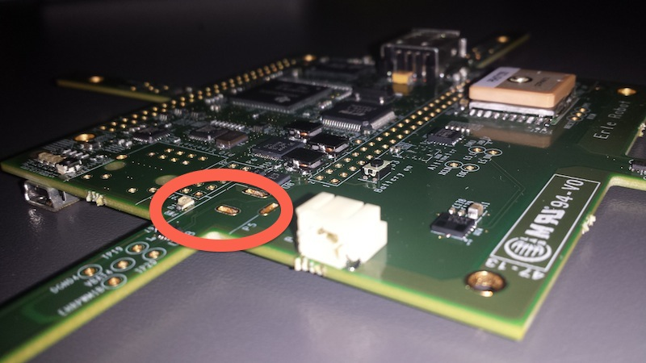

# Alimentación

LA seleción de cualquiera de los 5VDC o el USB como fuente de alimentación se maneja internamente por el TPS65217B y cambia automáticamente a la energía de 5VDC si ambos están conectados. El sotfware puede cmbiar la configuración de la alimentación a través de la interfaz I2C desde el procesador. Ademas, el sistema operativo puede leer el TPS65217B y determinar si la placa se está ejecutando en la entrada de 5VDC o la entrada USB. Esto puede ser beneficioso para conocer la capacidad de placa de proporcionar corriente para cosas como la frecuencia de operación las tarjetas de expansión.

### Circuito integrado de gestión de energía(PMIC)

El circuito integrado de gestion de la energía (PMIC) es el [TPS65217B](http://www.ti.com/product/tps65217). El *TPS65217B* es un único chip que consiste en un circuito de alimentación de doble entrada lineal, tres convertidores reductores, cuadtro LDOs y un conversor de alta eficiencia para alimentar dos cadenas de hasta 10 LEDs en serie. El sistema se alimenta por un puerto USB o un adaptador DC. tres conversores 2.25MHz redutores de alta eficiencia están dirigidos a proporcionar el voltaje del núcelo, MPU y el volaje de memoria de la placa.

Los convertidores entran en un modo de bajo consumo con cargar ligeras para un máxima eficiencia a través de la gama más amplia posible de las corrientes de carga. Para aplicaciones de bajo ruido los dispositivos pueden ser forzados a PWM de frecuencia fija utilizando la interfaz I2C. Lo conversores permiten el uso de pequeños inductores y condensadores para lograr un tamaño pequeño.

`LDO1` y `LDO2` tienen como objetivo apoyar el modo de espera del sistema. En el estado `SLEEP` la corriente es limitada a 100uA para reducir la corriente de reposo, mientras que el funcionamiento normal pueden soportar *hasta 100mA cada uno*. `LDO3` y `LDO4` pueden soportar *hasta 285mA cada uno*.

Por defecto *solo LDO1 siempre esta encendido* pero cualquier pista puede configurar el estado `SLEEP`. Especialmente los conversores DCDC pueden permanecer en un modo de PFM de baja potencia para soportar el modo de suspención del procesador. El TPS65217B ofrece flexibles secuencia de encendido y apagado y varias funciones de mantenimiento, tales como la producción de buena potencia de salida, reseteo de hardware y un sensor de temperatura para proteger la batería.

### 5V DC Alimentación de entrada

La alimentación de 5VDC se puede utilizar para propocionar alimentación a la placa. La corriente de alimentación depende de cuántos y qué tipo de *add on board* estén conectados a la placa. Para el uso típico, un suministro de 5VCC nominal de 1A debería ser suficiente. Si se espera un uso mayor de los soportes expansión o puerto host USB, entonces se requerirá un suministro de corriente más alto. Un `NCP349` sobre el dispositivo de tensión se utiliza para evitar problemas al conectar de 7V a 12V por errror. El `NCP349` se apagará y la placa no se enciende. No existe ningún indicador para un condición de sobretensión. La placa no se encenderá.

------

**La entrada de alimentación de 5VDC no se proporciona. Si se necesita, soldar un conector centro positivo de 2.1MM x 5.5MM de conector cilíndrico exterior**

------

### Alimentación USB

La placa puede ser alimentada por el puerto USB. Un **puerto USB tipico esta limitado a 500mA máximo**. Cuando arrancas desde el puerto USB, la pista `VDD_5V` no se proporciona en la cabera de expansión. Por lo tanto, los *capes` que necesiten esta pista no tendrán esta pista disponible para su uso.

La alimentación de 5VDC desde el puerto USB está disponible en la pista `SYS_5V` de la cabercera de expasión para el uso por un *cape*.

### Consumo de energía

| MODO | USB (mA) | DC (mA)* | DC + USB (mA) |
| -----|-----|----|----------|
| Reset| 200 | *80* | 220 |
| UBoot | 370 | *250* | 330 |
| Kernel booting (peak) | 510 | *360* | 470 |
| Kernel Idling | 300 | *180* | 300 |

---

\* Esta columna muestra el consumo aproximado de la placa cuando conectas un pin de los ESCs (5V BEC).

---

Cuando el USB está conectado, el `FT2232` y el `HUB` se encienden provocan un aumento en la corriente. Si no está conectado el USB, estos dispositivos se encuentran en un estado de baja energía, por lo tanto, esto ahorra más o menos 120mA de corriente y es la razón para el aumento de corriente cuando el USB está conectado.

La corriente fluctuará a medida cuando varias activaciones ocurran, como los LED y los accesos a la tarjeta SD.
