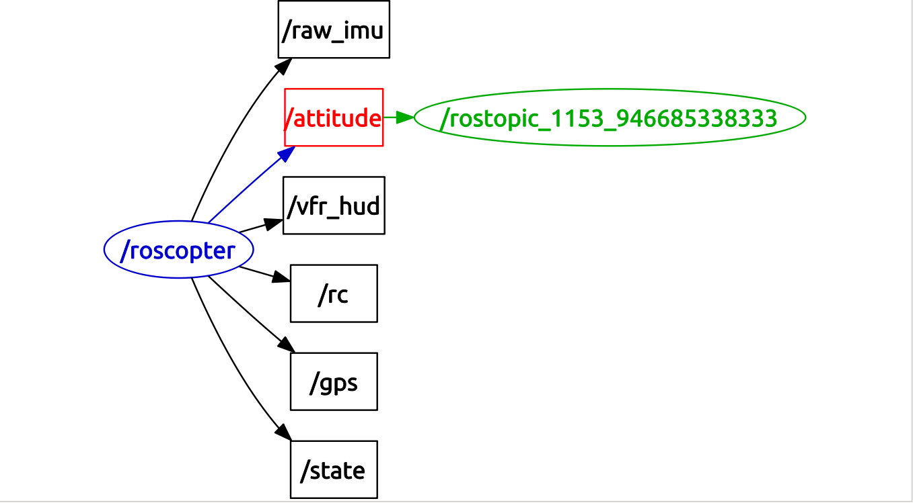

# roscopter

[roscopter](https://github.com/cberzan/roscopter) es un paquete de ROS que implementa un interfaz con Arducopter utilizando MAVLink 1.0. Permite controle el arducoptero sobreescribiendo el comando RC, y publicando todos lo datos del sensor (un paquete antiguo disponible [aquí](https://code.google.com/p/roscopter/)).

#### Compilando `autopilot_bridge`

Realice la compilación como se describe en [mavlink_ros:compiling instructions](mavlink_ros.md). El paquete debe de ser descargado en `~/catkin_ws/src` y `catkin_make` debe de ser ejecutado desde `catkin_ws` (revisar [ROS: Building a ROS Package](../../ros/tutorials/building_a_ros_package.md) para aprender más sobre el proceso de compilación de paquetes ROS).

Las instrucciones exactas para este paquete se encuentra en su [código fuente](https://github.com/cberzan/roscopter).

### Ejecutando `roscopter`

```bash
rosrun roscopter roscopter_node.py  --device=/dev/ttyO4 --baudrate=115200
```

```bash
root@erlerobot:~# rosrun roscopter roscopter_node.py  --device=/dev/ttyO5 --baudrate=115200
Waiting for APM heartbeat
Heartbeat from APM (system 1 component 1)
Sending all stream request for rate 10


```

`roscopter` puede ser lanzado utilizando una conexión de red:
```
rosrun roscopter roscopter_node.py  --device tcp:127.0.0.1:6000  --baudrate=115200
```

#### Jugando con `roscopter`

En otro terminal:
```bash
root@erlerobot:~# rostopic echo /attitude
roll: -0.99837321043
pitch: 0.778631448746
yaw: -0.439931690693
rollspeed: -0.00139412656426
pitchspeed: -0.00105890631676
yawspeed: 0.00113339431118
---
roll: -0.992067933083
pitch: 0.776587665081
yaw: -0.435508549213
rollspeed: -0.000329907052219
pitchspeed: -0.00105890631676
yawspeed: 6.91747991368e-05
---
roll: -0.985788047314
pitch: 0.774523973465
yaw: -0.431112319231
rollspeed: -0.00139412656426
pitchspeed: -0.00105890631676
yawspeed: 6.91747991368e-05
---
roll: -0.979533672333
pitch: 0.772440910339
yaw: -0.426743358374
rollspeed: -0.000329907052219
pitchspeed: -0.00212312862277
yawspeed: 6.91747991368e-05
---
roll: -0.973304569721
pitch: 0.770338177681
yaw: -0.42240139842
rollspeed: -0.000329907052219
pitchspeed: -0.00105890631676
yawspeed: 6.91747991368e-05


```

#### Visualizando `roscopter`



Comenzacemos a visualizar los valores de `/attitude` y veamos su representación gráfica:

---

**A través de todo este proceso la placa tiene que estas estática en tu escritorio. Los malos resultados no se deben a la mala actuación del paquete de ROS si no con los problemas con la estimación de la orientación dentro de ArduPilot**.
---

`rostopic echo /attitude`

and a plot using `rqt_plot /attitude/roll:pitch:yaw:rollspeed:pitchspeed:yawspeed`


These values are a bit unexpected so we repeat the process taking several screenshots:
`rostopic echo /attitude`

`rqt_plot /attitude/roll:pitch:yaw:rollspeed:pitchspeed:yawspeed`

`rqt_plot /attitude/roll:pitch:yaw:rollspeed:pitchspeed:yawspeed`

`rqt_plot /attitude/roll:pitch:yaw:rollspeed:pitchspeed:yawspeed`


Parece que hay un problema con la *attitude* :(.

*Por otro lado los valores `/raw_imu` no pueden ser visualizados*


